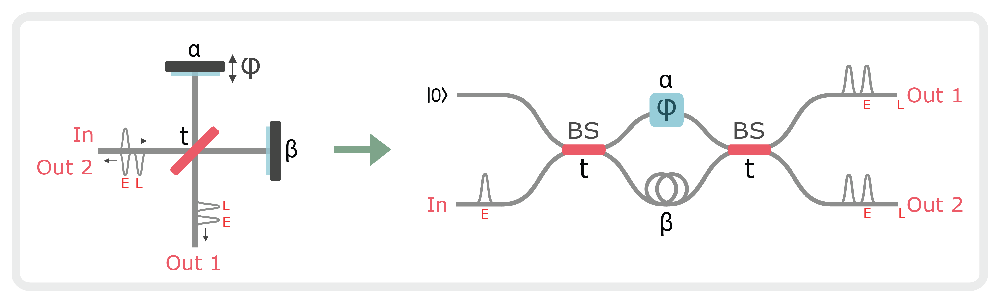
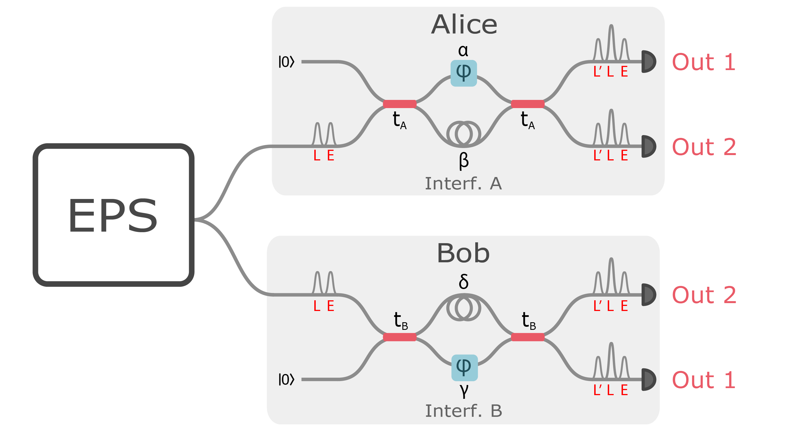
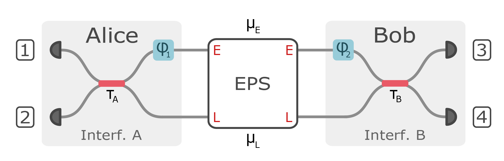
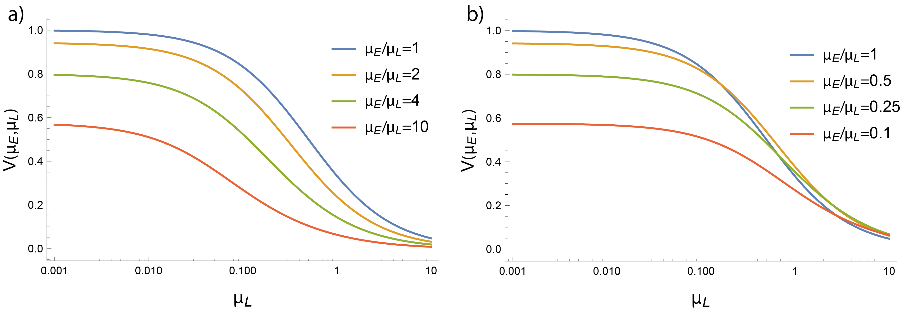

<!-- ## Aph 138b Homework Assignment -->

Note: the following section is primarily written by Samantha Davis, the second author of the paper [High-rate multiplexed entanglement source based on time-bin qubits for advanced quantum networks](https://arxiv.org/abs/2310.01804). **It is not a part of the main thesis** and does not appear in the thesis `.pdf`, as it is not primarily my work. However, it is included here for convenience and completeness.
## Impact of experimental imperfections on entanglement visibility

The experiment employs three Michaelson interferometers with a path-length delay of 80 ps: one at the source to generate the early and late time-bins, and one prior to each detector to control the measurement basis. To determine the effect of interferometric imperfections on the entanglement visibility, we model the interferometers as equivalent Mach-Zehnder interferometers as shown in Fig. [1](#fig:interf_model). Imperfections in the interferometer are captured by the transmittance $t$ of the beamsplitter and internal path (mirror) efficiencies $|\alpha|^2$ and $|\beta|^2$. An ideal Michaelson interferometer has $t = 1/\sqrt{2}$ and $|\alpha|^2 = |\beta|^2 = 1$.

<!-- \begin{figure}[h!]
    \centering
    \includegraphics[width=\textwidth]{interf_model.pdf}
    \caption{Model for Michaelson interferometers employed in the experiment. The interfomerter contains a beamsplitter with transmittance $t$ and two mirrors with efficiencies $\alpha$ and $\beta$.}
    \label{fig:interf_model}
\end{figure} -->

<figure markdown> 
     
     
    <figcaption markdown> Figure 1: **Michaelson interferometer model** Model for Michaelson interferometers employed in the experiment. The interfomerter contains a beamsplitter with transmittance $t$ and two mirrors with efficiencies $\alpha$ and $\beta$.</figcaption>
    </figure>

### Source Interferometer Imperfections

In the experiment, pulses of coherent light from a mode-locked laser (MLL) are injected into the input of the source interferometer. A field $\hat{E}$ at the input of the source interferometer transforms as

$$
\begin{align}
    \hat{E}_{\text{in}}  \rightarrow rt \alpha e^{i\varphi} \hat{E}_{E,1} +  r^2 \alpha e^{i\varphi}\hat{E}_{E,2} + rt\beta \hat{E}_{L,1} + t^2\beta \hat{E}_{L,2} + ir\sqrt{1-|\alpha|^2}\hat{E}_{\text{vac}_1} +it\sqrt{1-|\beta|^2}\hat{E}_{\text{vac}_2} \label{eq:source_field_transform}
\end{align}
\tag{1}$$

where the early and late temporal modes are denoted by subscripts “E” and “L”, the input and output modes are denoted by subscripts “in”, “1” and “2”, and $r = i\sqrt{1-|t|^2}$. Due to imperfect path efficiencies, part of the light leaks into the vacuum field mode $\hat{E}_{\text{vac}}$, which corresponds to the last term in Eq. [1](#eq:source_field_transform). It follows that the power of the early and late output pulses in terms of the power of the input pulse are

$$
\begin{align}
    &P_{E,1} = |r|^2|t|^2|\alpha|^2 P_{in},&P_{E,2} = |r|^4 |\alpha|^2 P_{in} \label{eq:powers}\\
    &P_{L,1} = |r|^2|t|^2|\beta|^2 P_{in} ,&P_{L,2} = |t|^4 |\beta|^2 P_{in}.\nonumber 
\end{align}
\tag{2}$$

%The splitting ratio $|t|^2$ and internal path efficiencies $|\alpha|^2$ and $|\beta|^2$ can be solved from ( Eq. [2](#eq:powers) ).

To generate the entangled photon pairs, one of the output ports of the source interferometer is up-converted by second harmonic generation (SHG) then down-converted via spontaneous parametric down conversion (SPDC), resulting in two-mode squeezed vacuum states (TMSVs) in early and late temporal modes with mean photon numbers $\mu_E$ and $\mu_L$, respectively. The ratio of $\mu_E$ to $\mu_L$ depends on which output port of the source interferometer is used. Note that the definition of $\mu$ used in the main text is per source laser period or per experiment cycle (4.09 GHz). Therefore $\mu$ from the main text is equal to $\mu_E + \mu_L$. The output power of SHG ($P_{SHG}$) as a function of the SHG pump power ($P_p$) is [@parameswaran2002observation],

$$
\begin{align}
    P_{SHG} = P_{p}\tanh^2{\sqrt{\eta_{SHG}P_{p}}} \approx \eta_{SHG}P_{p}^2
\end{align}
$$

where $\eta_{SHG}$ is the conversion efficiency of the SHG crystal. After SPDC, the squeezing parameter ($\xi$) of the TMSVs in terms of the SPDC pump power ($P_{SHG}$) is $\xi = \lambda \sqrt{P_{SHG}} \approx \lambda \sqrt{\eta_{SHG}}P_p$, where $\lambda$ is proportional to the SPDC crystal length and nonlinear interaction strength [@kaiser2016fully]. The mean photon number in terms of the squeezing parameter is $\mu = \sinh^2{\xi}\approx \xi^2$. Therefore, the mean photon numbers of the TMSVs as a function of the output pulses of the source interferometer are,

$$
\begin{align}
    &\mu_E \approx \lambda^2 \eta_{SHG} P_{E,i}^2 &\mu_L\approx \lambda^2 \eta_{SHG} P_{L,i}^2
\end{align}
$$

where $i = 1(2)$ corresponds to output port 1(2) of the source interferometer.

If output port 1 is used, $$\mu_E/\mu_L \approx P_{E,1}^2/P_{L,1}^2 = |\alpha|^4/|\beta|^4,$$ whereas if output port 2 is used, $$\mu_E/\mu_L \approx P_{E,2}^2/P_{L,2}^2 = |r|^8|\alpha|^4/|t|^8|\beta|^4.$$ When output port 1 of the source interferometer is used, if the internal path efficiencies of the source interferometer are different, there is an imbalance in the early and late mean photon numbers. When output port 2 is used, the effect of the imbalance in the internal path efficiencies on the ratio of early and late mean photon numbers can be compensated by imperfect transmittance: $\mu_E/\mu_L = 1$ when $|t|^2/|r|^2 = |\alpha|/|\beta|$.

### Measurement Interferometer Imperfections

<!-- \begin{figure}[h!]
    \centering
    \includegraphics[width=0.8\textwidth]{ent_visib_model.pdf}
    \caption{Setup for theoretical model of entanglement visibility experiment}
    \label{fig:ent_visib_model}
\end{figure} -->

<figure markdown> 
     
     
    <figcaption markdown> Figure 2: **Entanglement visibility model** Setup for theoretical model of entanglement visibility experiment</figcaption>
    </figure>

Imperfections in the measurement interferometers limit the entanglement visibility of the experiment. As described in the previous section, early and late TMSVs are generated by pumping the SPDC with early and late pulses. Each half of each TMSV is sent to a measurement interferometer (see Fig. [2](#fig:ent_visib_model)). Let $\ket{\xi}$ denote the TMSV state,

$$
\begin{align}
    \ket{\xi} = \sum_{n=0}^{\infty}(-1)^n \sqrt{\frac{\mu^n}{(1+\mu)^{n+1}}}\ket{n_A,n_B}
\end{align}
$$

where $\ket{n_A,n_B}$ denotes the state with $n_A$ photons at the input of interferometer A and $n_B$ photons at the input port of interferometer B. %As in the previous section, $\mu = \sinh^2{\xi}$ is the mean photon number where $\xi$ is the squeezing parameter. We model the input state to the measurement interferometers as a product state of TMSV in early and late temporal modes, to lowest order in $\mu_E$ and $\mu_L$:

$$
\begin{align}
    \ket{\Psi_{in}} =& \ket{\xi}_E\otimes \ket{\xi}_L \nonumber \\
    = &\left(\frac{1}{\sqrt{1+\mu_E}}\ket{0,0}_E -\sqrt{\frac{\mu_E}{(1+\mu_E)^2}}\ket{1,1}_E +\cdots\right)
    \otimes \left(\frac{1}{\sqrt{1+\mu_L}}\ket{0,0}_L -\sqrt{\frac{\mu_L}{(1+\mu_L)^2}}\ket{1,1}_L +\cdots\right)\nonumber\\
    \approx& \sqrt{1-(\mu_E +\mu_L)}\ket{0,0}_E \ket{0,0}_L -\sqrt{\mu_E}\ket{1,1}_E  \ket{0,0}_L  -\sqrt{\mu_L}\ket{0,0}_E  \ket{1,1}_L\label{eq:input_state}
\end{align}
\tag{3}$$

We can express Eq. [3](#eq:input_state) in terms of the creation operators $\hat{a}^\dagger$ and $\hat{b}^\dagger$ of the field modes at the inputs of interferometers A and B, respectively:

$$
\begin{align}
    \ket{\Psi_{in}} =\Big(\sqrt{1-(\mu_E+\mu_L)}-\sqrt{\mu_E} \hat{a}_{E}^{\dagger}\hat{b}_{E}^{\dagger} - \sqrt{\mu_L} \hat{a}_{L}^{\dagger}\hat{b}_{L}^{\dagger} \Big)\ket{0,0}_E\ket{0,0}_L \label{eq:input_state_fields}
\end{align}
\tag{4}$$

Since the measurement interferometers are also Michaelson interferometers, the transformation relations are,

$$
\begin{align}
    &\hat{a}_{E} \mapsto r_At_A \alpha e^{i\varphi} \hat{a}_{E,1} + r_A^2 \alpha e^{i\varphi}\hat{a}_{E,2} + r_At_A\beta \hat{a}_{L,1} + t_A^2\beta \hat{a}_{L,2}+c_A\hat{a}_{\text{vac}_1}+d_A\hat{a}_{\text{vac}_2},\label{eq:aE_transform} 
\end{align}
\tag{5}$$

$$
\begin{align}
    &\hat{b}_{E}  \mapsto r_Bt_B \gamma e^{i\varphi} \hat{b}_{E,1} + r_B^2 \gamma e^{i\varphi}\hat{b}_{E,2} + r_Bt_B\delta \hat{b}_{L,1} + t_B^2\delta \hat{b}_{L,2}+c_B\hat{b}_{\text{vac}_1}+d_B\hat{b}_{\text{vac}_2},\label{eq:bE_transform}
\end{align}
\tag{6}$$

$$
\begin{align}
    &\hat{a}_{L} \mapsto  r_A t_A \alpha e^{i\varphi} \hat{a}_{L,1}  + r_A^2 \alpha e^{i\varphi}\hat{a}_{L,2} + r_A t_A\beta \hat{a}_{L^\prime,1}+ t_A^2\beta \hat{a}_{L^\prime,2}+c_A\hat{a}_{\text{vac}_1}+d_A\hat{a}_{\text{vac}_2},\label{eq:aL_transform}
\end{align}
\tag{7}$$

$$
\begin{align}
    &\hat{b}_{L}  \mapsto r_B t_B \gamma e^{i\varphi} \hat{b}_{L,1} + r_B^2 \gamma e^{i\varphi}\hat{b}_{L,2}  + r_B t_B\delta \hat{b}_{L^\prime,1}+ t_B^2\delta \hat{b}_{L^\prime,2}+c_B\hat{b}_{\text{vac}_1}+d_B\hat{b}_{\text{vac}_2},\label{eq:bL_transform}
\end{align}
\tag{8}$$

$$
\begin{align}
    &c_A =ir_A\sqrt{1-|\alpha|^2}, \quad d_A=it_A\sqrt{1-|\beta|^2},\quad
    c_B =ir_B\sqrt{1-|\delta|^2},\quad\ d_B = it_B\sqrt{1-|\gamma|^2},\nonumber
\end{align}
$$

where $L^\prime$ denotes the temporal mode obtained by sending a photon in the late ($L$) mode through the long arm of an interferometer, and $\hat{a}_{\text{vac}_i}$, $\hat{b}_{\text{vac}_i}$ correspond to vacuum modes. To find the state at the output of the interferometers, we combine Eq. [4](#eq:input_state_fields) with Eq. [5](#eq:aE_transform) - Eq. [8](#eq:bL_transform), and consider only terms relevant to post-selection on coincidences of the middle bins (L) of different interferometer outputs, to lowest order in $\mu_E$, $\mu_L$,

$$
\begin{align}
    \ket{\Psi_{\text{out}}}= %&\sqrt{1-(\mu_E+\mu_L)}\ket{0,0;0,0}_E\ket{0,0;0,0}_L\ket{0,0;0,0}_{L^\prime} \\
    \cdots&+r_A^*t_A r_B^*t_B\Big(\beta \delta\sqrt{\mu_E}+\alpha \gamma \sqrt{\mu_L} e^{-2i\varphi}  \Big)\ket{0,0;0,0}_E\ket{1,0;1,0}_L\ket{0,0;0,0}_{L^\prime}\label{eq: output_state}\\
    &+r_A^*t_A\Big(t_B^2  \beta\delta \sqrt{\mu_E} + (r_B^*)^2  \alpha \gamma \sqrt{\mu_L} e^{-2i\varphi}\Big)\ket{0,0;0,0}_E\ket{1,0;0,1}_L\ket{0,0;0,0}_{L^\prime} \nonumber\\
    &+r_B^*t_B\Big(t_A^2\beta \delta\sqrt{\mu_E}  +(r_A^*)^2 \alpha \gamma  \sqrt{\mu_L} e^{-2i\varphi}\Big)\ket{0,0;0,0}_E\ket{0,1;1,0}_L\ket{0,0;0,0}_{L^\prime} \nonumber\\
    &+\Big(t_A^2 t_B^2\beta \delta\sqrt{\mu_E} + (r_A^*)^2 (r_B^*)^2 \alpha \gamma \sqrt{\mu_L} e^{-2i\varphi}\Big)\ket{0,0;0,0}_E\ket{0,1;0,1}_L\ket{0,0;0,0}_{L^\prime} + \cdots \nonumber 
\end{align}
\tag{9}$$

where $\ket{n_{A,1},n_{A_2};n_{B_1}, n_{B,2}}$ denotes the state with $n_{A,1}$ photons at output 1 of interferometer A, $n_{A,2}$ photons at output 2 of interferometer A, $n_{B,1}$ photons at output 1 of interferometer B, and $n_{B,2}$ photons at output 2 of interferometer B. We define the following parameters to simplify notation:

$$
\begin{align}
    x \equiv \frac{\mu_E}{\mu_L},\quad\quad\quad
    \kappa_A \equiv \frac{|\beta|^2}{|\alpha|^2}, \quad\quad\quad \kappa_B \equiv \frac{|\gamma|^2}{|\delta|^2},\quad\quad\quad \epsilon_A = \frac{|t_A|^2}{|r_A|^2}, \quad\quad\quad \epsilon_B \equiv \frac{|t_B|^2}{|r_B|^2}.
\end{align}
$$

From Eq. [9](#eq:output_state) , it follows that the coincidence probabilities for each combination of output ports are proportional to,

$$
\begin{align}
    &C_{A_1, B_1}(\varphi) \propto \sqrt{\frac{\kappa_B}{\kappa_A}}+\sqrt{\frac{\kappa_A}{\kappa_B}}x+2\sqrt{x}\cos{2\varphi},\\
    &C_{A_1, B_2}(\varphi) \propto \frac{1}{\epsilon_B}\sqrt{\frac{\kappa_B}{\kappa_A}}+\epsilon_B\sqrt{\frac{\kappa_A}{\kappa_B}}x+2\sqrt{x}\cos{2\varphi},\\
    &C_{A_2, B_1}(\varphi) \propto \frac{1}{\epsilon_A}\sqrt{\frac{\kappa_B}{\kappa_A}}+\epsilon_A\sqrt{\frac{\kappa_A}{\kappa_B}}x+2\sqrt{x}\cos{2\varphi},\\
    &C_{A_2, B_2}(\varphi) \propto  \frac{1}{\epsilon_A\epsilon_B}\sqrt{\frac{\kappa_B}{\kappa_A}}+\epsilon_A\epsilon_B\sqrt{\frac{\kappa_A}{\kappa_B}}x+2\sqrt{x}\cos{2\varphi},
\end{align}
$$

where the phase factors in the reflectivities $r_A, r_B$ are absorbed into the definition of $\varphi$. Therefore, the entanglement visibilities, $V = \frac{\text{max}(C(\varphi))-\text{min}(C(\varphi))}{\text{max}(C(\varphi))+\text{min}(C(\varphi))}$, for each combination of output ports are:

$$
\begin{align}
    &V_{A_1, B_1} = \frac{2\sqrt{x}}{\sqrt{\frac{\kappa_B}{\kappa_A}}+\sqrt{\frac{\kappa_A}{\kappa_B}}x}, \label{eq:FA1B1}
\end{align}
\tag{10}$$

$$
\begin{align}
    &V_{A_1, B_2} = \frac{2\sqrt{x}}{\frac{1}{\epsilon_B}\sqrt{\frac{\kappa_B}{\kappa_A}}+\epsilon_B\sqrt{\frac{\kappa_A}{\kappa_B}}x},\label{eq:FA1B2}
\end{align}
\tag{11}$$

$$
\begin{align}
    &V_{A_2, B_1} =  \frac{2\sqrt{x}}{ \frac{1}{\epsilon_A}\sqrt{\frac{\kappa_B}{\kappa_A}}+\epsilon_A\sqrt{\frac{\kappa_A}{\kappa_B}}x},\label{eq:FA2B1}
\end{align}
\tag{12}$$

$$
\begin{align}
    &V_{A_2, B_2} = \frac{2\sqrt{x}}{\frac{1}{\epsilon_A\epsilon_B}\sqrt{\frac{\kappa_B}{\kappa_A}}+\epsilon_A\epsilon_B\sqrt{\frac{\kappa_A}{\kappa_B}}x}.\label{eq:FA2B2}
\end{align}
\tag{13}$$

Unity visibility is achievable for each combination of output ports: $V_{A_1, B_1} = 1$ when $x = \kappa_B/\kappa_A$, $V_{A_1, B_2} = 1$ when $x = \kappa_B/(\kappa_A\epsilon_B^2)$, $V_{A_2, B_1} = 1$ when $x = \kappa_B/(\kappa_A\epsilon_A^2)$, and $V_{A_2, B_2} = 1$ when $x = \kappa_B/(\kappa_A\epsilon_A^2\epsilon_B^2)$. Therefore, the effect of imbalances in the source and measurement interferometers is to shift the optimal ratio of early to late mean photon numbers. Imbalances in the measurement interferometers can be compensated by imbalances in the source interferometer in order to obtain unity visibility. Moreover, in the single photon limit, the visibility is insensitive to the absolute path efficiencies in the experiment. The visibility depends only on the ratio of path efficiencies between the measurement interferometers ( $\kappa_A/\kappa_B$ ). The entanglement visibilities for each combination of output ports as a function of $x=\mu_E/\mu_L$ for various ratios of interferometric path efficiencies are shown in Fig. [3](#fig:ent_fid_single_photon).

<!-- \begin{figure}[H]
    \includegraphics[width = \textwidth]{ent_fid_single_photon_fixed_kappa.pdf}
    \caption{Entanglement visibility as function of $\mu_E/\mu_L$ for fixed $\kappa_B/\kappa_A = 1$ and  $ \epsilon_A = \epsilon_B = 90/10$ (red), $75/25$ (blue), $50/50$ (green), $25/75$ (purple).}
    \label{fig:ent_fid_single_photon}
\end{figure} -->

<figure markdown> 
     
     
    <figcaption markdown> Figure 3: **Visibility versus $\mu_E/\mu_L$** Entanglement visibility as function of $\mu_E/\mu_L$ for fixed $\kappa_B/\kappa_A = 1$ and $\epsilon_A = \epsilon_B = 90/10$ (red), $75/25$ (blue), $50/50$ (green), $25/75$ (purple).</figcaption>
    </figure>

### Multiphoton Effects

<!-- \begin{figure}[h!]
    \centering
    \includegraphics[width = \textwidth]{model_setup.pdf}
    \caption{Setup for phase space modeling of entanglement visibility experiment}
    \label{fig:model_setup}
\end{figure} -->

<figure markdown> 
     
     
    <figcaption markdown> Figure 4: **Entanglement visibility phase space modelling** Setup for phase space modeling of entanglement visibility experiment</figcaption>
    </figure>

Calculating the entanglement visibility to higher order photon number contributions quickly becomes intractable with the Fock space approach in section B. To study the effect of multiphoton events on the entanglement visibility, we model the experiment using phase space methods based on a characteristic function formalism [@Davis2022; @takeoka2015full]. The model setup is shown in Fig. [4](#fig:model_setup). As in the Fock space approach, the input state is modeled as a product state of TMSV in early and late temporal modes, with mean photon numbers $\mu_E$ and $\mu_L$, respectively. The measurement interferometers are modeled as beamsplitters in the temporal domain that mix the early and late input modes with transmittances $\tau_A$ and $\tau_B$, which absorb the interferometric path efficiencies and spatial beamsplitter transmittances. Since the input state is modeled as a Gaussian state, and the measurement interferometers are modeled as Gaussian operations, we can find the symplectic transformation that maps the characteristic function of the input state to that of the state prior to detection.

Following Ref. [@Davis2022], the characteristic function for an $N$-mode bosonic state is

$$
\begin{align}
    \chi(\xi)=\text{Tr}\left[\hat{\rho}\exp(-i(\hat{x}_1,\hat{p}_1,\hat{x}_2,\hat{p}_2,\cdots\hat{x}_N,\hat{p}_N) \xi)\right]
\end{align}
$$

where $\xi\in \mathbb{R}^{2N}$, $\rho$ is the density matrix, and $\hat{x}_i = \frac{1}{\sqrt{2}}(\hat{a}_i^\dagger+\hat{a}_i)$ and $\hat{p}_i=\frac{1}{\sqrt{2}}(\hat{a}_i^\dagger+\hat{a}_i)$ are the quadrature operators for mode $i$ with annihilation operator $\hat{a}_i$. A Gaussian state is a state whose characteristic function that takes a Gaussian form,

$$
\begin{align}
    \chi(\xi) = \exp(-\frac{1}{4}\xi^T\gamma \xi - id^T \xi),
\end{align}
$$

which is fully characterized by the displacement vector $d$ and covariance matrix $\gamma$, i.e. the first and second moments. For the TMSV state, the displacement vector is the null vector $d =(0,0,0,0)$ and the covariance matrix is given by

$$
\begin{align}
    \gamma_{TMSV}(\mu) = 
    \begin{pmatrix}
    \mathbf{A}&\mathbf{B}\\
    \mathbf{B}&\mathbf{A}
    \end{pmatrix}, \quad
    \mathbf{A}=
    \begin{pmatrix}
        1+2\mu&0\\
        0&1+2\mu
    \end{pmatrix}, \quad
    \mathbf{B}=\begin{pmatrix}
        2\sqrt{\mu(\mu+1)}&0\\
        0&-2\sqrt{\mu(\mu+1)}
    \end{pmatrix}
\end{align}
$$

where $\gamma_{TMSV}(\mu)$ is written in block matrix form. Therefore, the covariance matrix for the input state of our experiment is

$$
\begin{align}
    \gamma_{in}(\mu_E,\mu_L) = \gamma_{TMSV}(\mu_E)\oplus \gamma_{TMSV}(\mu_L)
\end{align}
$$

The characteristic function of the input state is mapped to the characteristic function of the state prior to detection by a symplectic transformation,

$$
\begin{align}
    \chi_{in}(\xi) = \exp(-\frac{1}{4}\xi^T\gamma_{in} \xi)\mapsto \chi_{out}(\xi) = \exp(-\frac{1}{4}\xi^T S^T \gamma_{in}S \xi)
\end{align}
$$

where $S$ is the Symplectic matrix of the interferometers. We construct $S$ from the Symplectic matrices of the phase shifter ($S_{PS}$) and beamsplitter ($S_{BS}$) [@takeoka2015full],

$$
\begin{align}
    &S_{PS}(\varphi) = \begin{pmatrix}
        \cos{\varphi}&\sin{\varphi}\\
        -\sin{\varphi}&\cos{\varphi}
    \end{pmatrix},\\
    &S_{BS}(\tau) = 
    \begin{pmatrix}
    \mathbf{T}&\mathbf{R}\\
    \mathbf{R}&\mathbf{T}
    \end{pmatrix}, \quad
    \mathbf{T}=\begin{pmatrix}
        \tau&0\\
        0&\tau
    \end{pmatrix}, \quad \mathbf{R}=
    \begin{pmatrix}
    0&-\sqrt{1-\tau^2}\\
    \sqrt{1-\tau^2}&0
    \end{pmatrix}.
\end{align}
$$

From the output characteristic function $\chi_{\text{out}}$, we obtain the coincidence probabilities using Eq. (9) of Ref. [@Davis2022],

$$
\begin{align}
    \text{Tr}\left[\hat{\rho}_{\text{out}}\hat{\Pi}\right] = \left(\frac{1}{2\pi}\right)^N \int {dx}^{2N}\chi_{\text{out}} (x) \chi_\Pi (-x)
\end{align}
$$

where $\hat{\rho}_{\text{out}}$ is the state prior to detection with characteristic function $\chi_{\text{out}}$, and $\hat{\Pi}$ is the measurement operator corresponding to coincidences between detectors from different interferometers. The measurement operators for a threshold detector, which distinguishes between a detection event (at least one photon) and no detection event (zero photons), are

$$
\begin{align}
    \hat{\Pi}_{\text{event}} = \hat{I}-\ket{0}\bra{0}, \quad  \hat{\Pi}_{\text{no event}} = \ket{0}\bra{0}
\end{align}
$$

where $\hat{I}$ is the 2 by 2 identity matrix. The measurement operator for coincidences between e.g. detectors 1 and 4 are

$$
\begin{align}
    \hat{\Pi}_{1,4}=\hat{\Pi}_{\text{event},1}\otimes\hat{I}_2 \otimes \hat{I}_3 \otimes \hat{\Pi}_{\text{event},4}
\end{align}
$$

where the subscripts denote the output modes labeled in Fig. [4](#fig:model_setup). We derive an analytical expression for the coincidence probability that encompasses all multiphoton contributions,

$$
\begin{align}
C(\varphi) =  \text{Tr}\left[\hat{\rho}_{\text{out}}\hat{\Pi}_{1,4}\right] &= 1-\frac{1}{|f(\mu_E, \mu_L, \tau_A)|}-\frac{1}{|g(\mu_E, \mu_L, \tau_B)|}+\frac{1}{|h(\mu_E, \mu_L, \tau_A, \tau_B,\varphi)|},\\
f(\mu_E, \mu_L, \tau_A) &= 1+\mu_L+\tau_A(\mu_E - \mu_L),\\
g(\mu_E, \mu_L, \tau_B) &= 1+\mu_E+\tau_B(\mu_L - \mu_E),\\
h(\mu_E, \mu_L, \tau_A, \tau_B) &=1+\mu_E + \mu_L(1 + \mu_E)(1 -\tau_A) \\
&-\mu_E\tau_B(1 + \mu_L) +\tau_A\tau_B(\mu_E  + \mu_L +2\mu_E\mu_L) \nonumber\\
&- 2\sqrt{\mu_E\mu_L\tau_A(1+\mu_E)(1+\mu_L)(1-\tau_A)}\sqrt{\tau_B(1-\tau_B)}\cos{\varphi},\nonumber
\end{align}
$$

where $\varphi = \varphi_A-\varphi_B$ is the relative phase between interferometers A and B. The different visibilities in each output port combination as a result of interferometric imbalances can be obtained by adjusting $\tau$ accordingly. To isolate the impact of multiphoton contributions to the visibility, we set $\tau_A = \tau_B = \frac{1}{\sqrt{2}}$, and obtain the following expression for the entanglement visibility:

$$
\begin{align}
    V(\mu_E, \mu_L) &= \frac{C(0)-C(\pi)}{C(0)+C(\pi)}=\frac{2/\sqrt{G_{-}(\mu_E, \mu_L)}-2/\sqrt{G_{+}(\mu_E, \mu_L)}}{1-4/(2+\mu_E+\mu_L)+2/\sqrt{G_{-}(\mu_E, \mu_L)}+2/\sqrt{G_{+}(\mu_E, \mu_L)}}\label{eq:fid_multiphoton}
\end{align}
\tag{14}$$

where

$$
\begin{align}
     G_{\pm}(\mu_E, \mu_L)&=\mu_E^2(9+8\mu_L(2+\mu_L))\\
     &\pm(4+3\mu_L)\bigg(\pm4\pm3\mu_L+4\sqrt{\mu_E \mu_L (1+\mu_E)(1+\mu_L)}\bigg)\nonumber\\     &+2\mu_E\bigg(12\pm6\sqrt{\mu_E\mu_L(1+\mu_E)(1+\mu_L)}\bigg)\nonumber\\
     &+2\mu_E\mu_L\Big(19+8\mu_L \pm 4\sqrt{\mu_E\mu_L (1+\mu_E)(1+\mu_L)}\Big). \nonumber
 \end{align}
$$

By expanding Eq. [14](#eq:fid_multiphoton) to first order in $\mu_E$ and $\mu_L$,

$$
\begin{align}
    V(\mu_E,\mu_L) = \frac{2\sqrt{\frac{\mu_E}{\mu_L}}}{1+\frac{\mu_E}{\mu_L}} - \frac{\mu_E}{\mu_L}\frac{\left(5(\frac{\mu_E}{\mu_L}+\frac{\mu_L}{\mu_E})+6\right)}{2(1+\frac{\mu_E}{\mu_L})^2}\sqrt{\mu_E\mu_L}+\cdots\label{eq:fid_first_order}
\end{align}
\tag{15}$$

we see that the first term matches Eq. [10](#eq:FA1B1) - Eq. [13](#eq:FA2B2) for $t_A = t_B = \frac{1}{\sqrt{2}}$, $\beta/\alpha = \gamma/\delta = 1$. Moreover, for $\mu_{eq} \equiv \mu_E = \mu_L$, Eq. [15](#eq:fid_first_order) reduces to $V(\mu_{eq}) = 1 - 2\mu_{eq}$.

Thus, the upper bound on the visibility is set by the mean photon number, i.e. multiphoton effects. Entanglement visibilities of more than 90% are possible when $0.39 < \mu_E/\mu_L < 2.55$ and $\mu_L < 0.0.056$. The entanglement visibility $V(\mu_E, \mu_L)$ in Eq. [14](#eq:fid_multiphoton) is plotted for various mean photon numbers in Fig. [5](#fig:fid_multiphoton).

<!-- 
\begin{figure}[H]
\centering
    \begin{subfigure}{0.75\textwidth}
        \centering
        \includegraphics[width = \textwidth]{Fid_vs_mu_above_1.pdf}
    \end{subfigure}
    \bigskip
    \begin{subfigure}{0.75\textwidth}
        \centering
        \includegraphics[width = \textwidth]{Fid_vs_mu_below_1.pdf}
    \end{subfigure}
    \caption{Entanglement visibility as a function of mean photon number for $\tau_A = \tau_B = 1/\sqrt{2}$.}
    \label{fig:fid_multiphoton}
\end{figure} -->

<figure markdown> 
     
     
    <figcaption markdown> Figure 5: **Entanglement visibility vs photon number** Entanglement visibility as a function of mean photon number for $\tau_A = \tau_B = 1/\sqrt{2}$.</figcaption>
    </figure>

<!-- Keep at end of the page! -->

