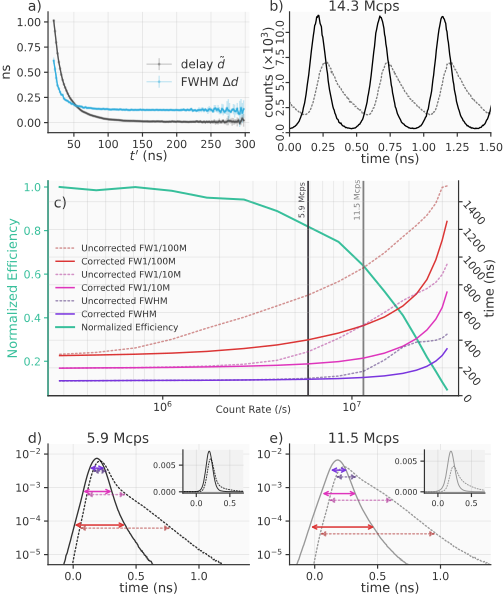

## Introduction
$$ \require{upgreek} $$
Time-resolved photon detection with low dark counts is a vital technology in fields such as quantum information processing, classical communication, quantum communication, and laser ranging. Increasingly, research in these fields employs superconducting nanowire single photon detectors (SNSPDs), which have been demonstrated with system detection efficiency ($\eta$) of more than 90% [@Reddy2020], timing jitter ($\Delta t$) as low as 2.6 ps [@Korzh2020] and intrinsic dark count rates ($D$) in the milli- to  micro-hertz range [@Hochberg2019]. However, quantum communication applications require detection systems with performance optimized across all three metrics simultaneously. The dimensionless figure of merit  $H$ specifies this application-specific performance as $H = \frac{\eta}{(\Delta t D)}$  [@Hadfield2009]. 

Here, we focus on lowering the Dark Count Rate (DCR) of a telecom-band SNSPD system by filtering thermal photons, without sacrificing efficiency or jitter. We demonstrate a free-space coupled SNSPD with sub-0.1 Hz DCR, 14 ps timing jitter, and 72% total system detection efficiency (SDE) by using a differential single-pixel SNSPD [@Colangelo2021] to image a single-mode fiber through an optimized free-space filter stack.

%HARDWARE
\begin{figure}[htbp]
\centering\includegraphics[width=\linewidth]{Hardware and Filters Squashed 2.pdf}
\caption{\small a) System hardware. ASPH: aspheric lens, %(Edmund Optics \#47-729)
SP1 \& SP2: custom short-pass filters, BP: band-pass filter, %(Semrock NIR01-1550/3-25),
BK7: glass windows, SMF: Single-mode fiber, PEL: Peltier element, LC: Liquid cooling block. b) Transmission spectra for the three filters utilized. c) Absorption spectrum for the SNSPD efficiency-enhancing optical stack.}
\label{fig:setup}
\end{figure}
%We compare performance with a fiber-coupled configuration using the same detector. 

The highest system detection efficiencies have been achieved using self-aligned fiber coupling where dark counts can be reduced using cryogenic fiber looping [@Cohen2015] or spliced narrow-band filters [@Boaron2018secure]. But it is difficult to achieve strong filtering without losses at the target wavelength. Low-loss, high-rejection filters are typically available as free-space components, so some of the highest reported H-values were achieved with cryogenic, fiber to free-space to fiber coupling, but exhibit an SDE of only a few percent  [@Shibata2015]. The filtering method presented here takes advantage of commercially-available filters, achieves a high free-space coupling efficiency using a cryogenic lens, and is compatible with both fiber and free-space optical inputs.

In this work, a single mode fiber is imaged onto the detector using two f = 18.75  mm lenses. One lens collimates light from an optical fiber face outside the cryostat (Photon Spot), and the other focuses light onto the detector inside  [@Bellei:16]. In the collimated region between, the beam passes though a series of short-pass filters and one band-pass filter mounted at 4 K (Fig. \ref{fig:setup}a). One of the short-pass filters is angled to avoid ghosting effects. The 40 K radiation shield and outer cryostat housing are fitted with anti-reflection coated BK7 windows. The filters are spring loaded to prevent cracking at low temperatures. To minimize effects of stray light, the interior of the 4 K shield was painted with mid-IR absorbing paint (Aeroglaze Z306)  [@Persky1999], while gaps between filters and the windows were covered with metal tape. 

The system is based on 1-inch optics, although the f = 18.75 mm lenses lead to a $1/e^2$ intensity diameter of about 5 mm in the collimated region. To reduce the larger-than-required numerical aperture of the system, painted 8 mm apertures (Acktar Spectral Black) were added in the collimated region. These are large enough to allow minor alignment adjustments --- by translating the exterior collimating lens --- without vignetting. 

\begin{figure}[htbp]
\centering
\centering\includegraphics[width=\linewidth]{DataFigure_6.pdf}
\caption{ \small a) Simulated photon flux at various temperatures with and without the 1550 nm bandpass filter (BP). b) Normalized photon count rate (PCR) and jitter measurements c) DCR, and calculated figure of merit $H$ versus bias current for both fiber-coupled and free space coupled configurations.}
\label{fig:false-color}
\end{figure}

We use four custom cryogenic short-pass filters, with pass-bands below $1.6 \ \mathrm{\upmu m}$ and $1.9 \ \mathrm{\upmu m}$ (Andover Corp.), both with transmission at 1550 nm of 98.8 ± 0.3\%. They reject wavelengths shorter than 3 {\textmu}m through reflective optical coatings, and attenuate longer wavelengths through material absorption in the 12.7 mm-thick N-BK7 glass substrate. While the bandpass filter (FWHM = 7 nm) was found to blue-shift by about 2 nm at cryogenic temperatures, the passband was wide enough such that significant attenuation was not observed at the original target wavelength of 1550 nm. This filter is also sufficiently wide to avoid Fourier-limited broadening of ultra-short laser pulses. 

The filtering of the optical stack was modeled by assuming a black-body emitter at 298 K and a field of view defined by the 18.75 mm focal length of the cryogenic lens and the 8 mm diameter of the apertures. The resulting spectrum was multiplied by the transmission of the filters (Fig. \ref{fig:setup}b) and detector optical stack (Fig. \ref{fig:setup}c). The model showed that two each of the 1.6 {\textmu}m and 1.9 {\textmu}m short pass filters were necessary to suppress mid-infrared light to where it was no longer the dominant source of dark counts. With the inclusion of the four shortpass filters, the dominant source of dark counts is the spectral region near 1550 nm as shown in Fig. \ref{fig:false-color}a, which also illustrates the effect of the bandpass filter. Also evident in Fig. \ref{fig:false-color}a is the strong dependence of DCR on the temperature of the final surface outside the cryostat emitting thermal radiation. This motivated the exterior cooling apparatus shown at the bottom of Fig. \ref{fig:setup}a. The bulkhead holding the fiber connector is cooled to around -2$^\circ$C using a Peltier element and liquid cooling block. This addition reduced the system DCR from 0.4 Hz to below 0.1 Hz. While dark counts from multiple spatial modes are present in this system — modes that would not be present in a purely fiber based approach — the external cooling technique works to minimize their effect.

This work used a low-jitter, differential SNSPD \cite{Colangelo2021}, with an active area of 22 $\times$ 15 {\textmu}m, formed by a meander of 100 nm-wide and 5-nm-thick niobium nitride (NbN) nanowires on a 500 nm pitch. A more conventional single-ended readout SNSPD of similar area would also achieve low DCR in this coupling system, but would likely achieve a lower performance metric $H$ from correspondingly higher jitter. The nanowire is embedded in an efficiency-enhancing optical stack made of alternating layers of TiO$_2$ and SiO$_2$ and a gold mirror layer. As shown in Fig. \ref{fig:false-color}b and c, when fiber coupled (without any fiber-based filtering methods applied), this detector achieved a saturated SDE of $84\% \pm 4.4 \%$ and a DCR of 20 Hz at a bias current of 16 {\textmu}A. 

As also shown in Fig. \ref{fig:false-color}b, the free-space coupling system achieves up to $72 \% \pm 3.7 \%$ SDE as measured from the fiber outside the cryostat. The reduction in efficiency is likely due to surface reflections in the free-space optics, and potential misalignment in the optical baffles. The minimum DCR (Fig. \ref{fig:false-color}c) at $72 \%$ SDE is about 0.1 Hz, with a bias current of 16 {\textmu}A. These metrics, with the jitter measurements shown in Fig. \ref{fig:false-color}b, give a maximum H value of $5 \times 10^{11}$ (Fig. \ref{fig:false-color}c). Values as high as $1.8 \times 10^{12}$ have been reported before, but at 1.5\% system detection efficiency \cite{Shibata2015}. Our system shows a low DCR can be achieved without severe reduction of SDE or usable target wavelength bandwidth. This is paramount for the future of terrestrial and space-to-ground quantum communication, since it increases success rate with finite statistics \cite{Boaron2018secure}. The same techniques can be applied to emerging SNSPD applications at longer wavelengths, such as laser ranging \cite{Taylor2019}, where fiber filtering is impractical. Beyond single-mode applications, our work paves the way to scalable, low-DCR, multi-mode coupling to SNSPD arrays \cite{Wollman2019}.

{#fig:custom_figure
short-caption="The second first caption."
width=70%}

{#fig:custom_second_figure
short-caption="The second first caption."}

&nbsp;&nbsp;&nbsp;&nbsp;&nbsp;The central aim of this dissertation is to
explore the biophysical mechanisms by which these levels of adaptation --
molecular, physiological, and evolutionary -- are interconnected. Furthermore, in the spirit of
Monod, we seek to make our exploration quantitative and leverage the tools of
statistical physics to provide precise predictions from pen-and-paper theory
that can be rigorously tested through experiment. The remaining sections of
this chapter will outline the major topics of this thesis and place them in a
historical context alongside the work of Monod. This thesis is structured such
that **Chapters 1 -- 5** present a self-contained summary of how quantitative
methods can be used to interrogate and understand the molecular biophysics of
adaptation. The remainder, **Chapters 6 -- 9**, are detailed supplements to
Chapters 1 -- 5,s and are targeted to readers who want to dig into the weeds of
statistical inference, error estimation, and analytic properties of the
theoretical models.  

This is a new section thing I'm adding
