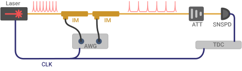

## Method and Results

### Experimental setup

The measurements used for calibration and correction were acquired with a high rate mode locked laser (*Pritel*). The minimum repetition rate of this laser was too high to produce a calibration dataset for the Tungsten Silicide detector at highest count rate, given the constraints addressed in the main text. Therefore, the laser was set at a repetition rate of 10.75 GHz and modulated down to 537.5 MHz using two lithium niobate intensity modulators in series. Residual peaks from suppressed mode-locked laser pulses are not observed above the noise floor in the collected data, so their effect was not further considered. Clock jitter is minimized in post-processing with the help of a software-based Phase Locked Loop. 

{#fig:jitterate_exp_setup short-caption="Time walk experiment setup" width=90% path="chapter_03"}

### Detector and trigger level

We study the pulse distortions observed in a fiber coupled single-pixel tungsten silicide (WSi) SNSPD with 380~$\mathrm{\upmu m^2}$ active area and 160~nm nanowire width. The detector is biased at 9.3~$\mathrm{\upmu A}$, roughly 90\% of the switching current. The readout is handled by a cryogenic DC-coupled amplifier, mounted on the 40~K-stage of the cryostat, which has 43~dB of gain and a 3~dB bandwidth of 700 MHz, followed by a 1~GHz amplifier with 20~dB of gain (*MiniCircuits ZFL-1000LN+*). The system reaches a $3~\mathrm{dB}$ maximum count rate (MCR) of $15.6~\mathrm{MHz}$. The time constant of supercurrent recovery $\tau_{bias} \approx 40~\mathrm{ns}$ is significantly longer than the decay time constant of the RF pulse $\tau_{RF} \approx 5~\mathrm{ns}$, owing to our use of a low-frequency cut-on of $\approx 80$~MHz (-3~dB point from the peak gain) in the DC-coupled amplifiers. For this detector, the calibration process primarily corrects for the lower bias current effects, rather than for any overlapping between RF pulse waveforms (see [the section on the WSi detector performance regime](./section_06_extra.md#performance-regime-of-the-tungsten-silicide-detector)section \ref{performance-regime-of-the-tungsten-silicide-detector}). Other detector types and readout systems may operate in a different regime. 

The jitter increase with count rate is highly dependent on trigger level. High rate distortions affect the timing measurements less if the threshold voltage is set just above the noise floor. 
But triggering on the pulse higher, where it achieves maximum slope, minimizes jitter at low-to-medium count rates. This level varies from 20\% to 50\% of pulse height depending on the detector. We found the minimum low-rate jitter at a trigger level of 50~mV, about 40\% of the pulse height. All further calibration and analysis is performed by triggering at this level in order to optimize jitter across all count rates.

### Mode locked laser calibration

To perform our calibration, we illuminated the SNSPD with an attenuated 537.5~MHz mode locked laser with a mean photon number per pulse between $5\mathrm{e}{-4}$ and $0.016$. The 1.86~ns period of the pulse sequence is large enough that almost all SNSPD detections can be unambiguously matched with a preceding laser pulse -- the period of the pulse train used must be greater than the worst detector jitter for this to succeed. The uncorrected jitter for the WSi detector varies from 50~ps FWHM at low count rates, to about 350~ps at high rates.

![**Calibration Method** a) A qualitative diagram illustrating how inter-pulse timing measurements $t'$ and $d$ are extracted. A small fraction of laser pulses contain a photon due to the low mean photon number per pulse of the attenuated laser. Pairs of subsequent photon arrivals are separated by a time denoted by $t' = n t_l$. b) Possible distributions of delay $d$ measurements for two different $t'$. The median of these defines the extracted delay parameters $\tilde{d}$ which form the y-axis in the calibration curve illustrated in (c). The $\tilde{d}$ vs $t^\prime$ curve in (c) approaches zero for $t^\prime$ approaching infinity. Blue and green arrows with matching color and style denote the same measure in (a), (b), and (c).](./figs/jitterate_explain_light.svg){#fig:jitterate_explain short-caption="Calibration method for extracing t' vs delay" width=70% path="chapter_03"}

We collect sorted time-tags and first consider adjacent pairs of SNSPD events as illustrated in @fig:jitterate_explain a. The time between the two photons that produced these event pairs is defined as $t^\prime$, which is an integer number of laser periods ($t^\prime = n t_{l}$). Second, we derive the delay between the second event and its corresponding laser pulse, defined as $d$. For each laser period spacing $t^\prime$, we make a histogram of the second event delays and find the median ($\tilde{d}$) and the FWHM ($\Delta {d}$) of this distribution. For shorter separations $t^\prime$, the distribution is expected to have larger delays and FWHM (@fig:jitterate_explain b) due to the smaller pulse height of the second event. Finally, we use the median delay as a function of laser spacing (@fig:jitterate_explain c) to form a curve $\tilde{d}$-vs-$t^\prime$ for the added time-walk versus inter-arrival time.

{#fig:jitterate_results_1 short-caption="t-prime curve and correction effect" width=90% path="chapter_03"}

@fig:jitterate_results_1 a shows the $\tilde{d}$-vs-$t^\prime$ and $\Delta d$-vs-$t^\prime$ curves collected from our measurements of the WSi detector. The $\tilde{d}$-vs-$t^\prime$ curve is the main result of the calibration process and is used as a lookup table in the correction method. $\Delta d$ is a measure of the more intrinsic jitter that the correction method cannot cancel out. While it is larger for small $t^\prime$ due to triggers on lower amplitude pulses, it notably stays at a nearly minimized value down to around $t^\prime =$ 50~ns. $\tilde{d}$ grows more dramatically with decreasing $t^\prime$, especially in the range from 50~ to 100~ns. For count rates that don't exhibit many inter-pulse arrival times smaller than 50~ns, a method for removing the time-walk effect's contribution to jitter should bring entire system jitter back down to near the intrinsic limit implied by the $\Delta d$ curve. 

The correction method we implement involves subtracting off the distortion-induced delays a time-tag is expected to have based on the inter-pulse-time that precedes it. For each time tag $t_n$ in a set, the inter-pulse time is $t_n - t_{n-1} = \Delta t$, where $t_{n-1}$ is the previous tag on the same channel. Using $\Delta t$ as an index, a corresponding delay correction $\hat{d}$ is found by interpolating the $\tilde{d}$-vs-$t^\prime$ curve from the calibration. Given the density of points in the $\tilde{d}$-vs-$t^\prime$ acquired here, a linear interpolation is sufficient. The correction may benefit from higher order interpolation if the $\tilde{d}$-vs-$t^\prime$ curve is more sparse. This would be the case for calibrations built from a slower repetition rate pulsed light source.  An assumption underlying the correction is that the interpolated value $\hat{d}$ is a good estimator of the true delay added to the current time-tag due to high count rate pulse distortions.

With the interpolation operation expressed as a function $D$, the correction is written as $\overline{t}_n = t_n - D(\Delta t)$, where $\overline{t}_n$ is the corrected version of tag $t_n$. Whether $t_{n-1}$ is itself corrected or uncorrected has negligible influence on the $t_n$ correction, as we assume $d << \Delta t$. The data correction shown here was applied in post-processing. But since $D$ depends only on the current time tag and information available from earlier, the correction can be applied in real-time in an FPGA or computer used for time tagging.

![**Jitters metrics across incident powers** (a) Effect of the correction on measurements of system jitter over a range of rates approaching the maximum count rate. (b) Corrected (solid) and uncorrected (dashed) instrument response functions with color-matched arrows showing the location of the width-statistics plotted above in (a). The black vertical line in (a) is drawn at the count rate of this plot. Inset shows linear scaling. (c) Corrected (solid) and uncorrected (dashed) histogram analogous to (b), but at a higher count rate indicated by the grey line in (a).](./figs/jitterate_data_c_light.svg){#fig:jitterate_results_2 short-caption="Jitters metrics across incident powers" width=90% path="chapter_03"}

The correction we perform using the $\tilde{d}$-vs-$t^\prime$ curve in @fig:jitterate_results_1 a is applicable to a wide range of count rates and arbitrary modulation patterns; there is no requirement that applications match the repetition rate of the calibration laser. @fig:jitterate_results_1 b shows that the correction method, derived from the 537.5 MHz calibration data, significantly reduces jitter when applied to detections from a 2.15~GHz pulse train. A similar jitter reduction can be demonstrated for repetition rates below 537.5~MHz. 

To study the effectiveness of our correction method at different count rates, we apply it to data collected at different mean photon numbers per pulse, with the same 537.5 MHz pulse train. As shown in @fig:jitterate_results_2 c, the correction improves the FWHM at rates approaching the 3~dB point, and improves FW10\%M and FW1\%M (full width at ten percent/one percent maximum) dramatically, even at count rates significantly below the 3 dB point, where detector efficiency is nearly maximized. This reduction is evident in @fig:jitterate_results_2 c, where the correction works to remove a time-walk induced tail in the instrument response function. The ratio of corrected FW1\%M over uncorrected FW1\%M reaches a minimum of 0.55 at a count rate of 11.5 MCounts/s. Therefore if an application sets its repetition rate or bin size based on the FW1\%M metric, the repetition rate can be increased and the bin size decreased by up to 45\% without any increase in event misattribution errors. These improvements are notable for applications including biomedical imaging~[@Sutin16; @Bruschini2019], quantum communication~[@Hadfield2009] and laser ranging~[@McCarthy13] that have stringent timing requirements over a large dynamic range. 