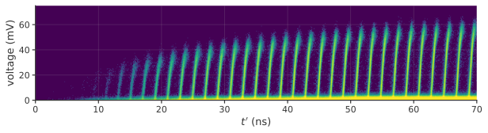

### Performance regime of the tungsten silicide detector

When our calibration and correction method is applied to the Tungsten Silicide SNSPD, the walk-cancellation method primarily corrects for pulse height variations. These variations are caused by varying levels of bias current in the device at the time of photo-detection. An oscilloscope trace shows an exponentially decaying increase in SNSPD pulse height following a previous detection. This exponential recovery shape reinforces evidence that this detector operates in this 'bias current recovery' regime, rather than the regime where amplifier reset dynamics dominate.

{#fig:rise_exp short-caption="WSi pulse exponential pulse recovery" width=100% path="chapter_03"}

```{=html}
??? note
    This is a real scope trace that shows the same inverted exponential recovery effect:

    
    
```

### Software dead time for high count rate jitter suppression

In certain cases a software-based dead time is an effective way of reducing jitter at high count rates. SNSPD pulses that arrive soon after a previous pulse are ignored because their timing is assumed to be corrupted due to pulse distortions (Fig. \ref{fig:dead_time}a). With a long software-based dead time, data is filtered to keep only events for which the SNSPD was in a fully reset state prior to detection. This results in low jitter measurements even at high rate as shown in Fig. \ref{fig:dead_time}d where the dashed and solid (red, orange) lines are response functions of unfiltered and filtered data, respectively. However, the use of software-based dead times can severely limit usable count rate. This paradoxically contrasts with the main intended goal, which is to operate an SNSPD at the highest possible count rates. As shown in the Fig. 3b, adding a 100 ns software dead time to our WSi single pixel SNSPD limits its usable maximum count rate to about 4 MHz, while the raw count rate exceeds 10 MHz. Furthermore, the usable count rate drops to zero for higher incident photon rates, as the dead time starts to reject most events. This behavior can be unexpected and problematic for any applications that occasionally over-saturate the detector.

</span><span class="latex">Fig.~\ref{fig:jitterate_results_2}</span>. (c) & (d) Response functions for timetaggs at two count rates denoted by the vertical lines in (b), similar to <span class="html">[the same figure (b) and (c)](section_04_method.md#fig:jitterate_results_2)</span><span class="latex">Fig.~\ref{fig:jitterate_results_2} (b) and (c)</span>. The dark grey solid lines show response functions from the calibration and correction method which does not limit count rate. The 100 ns dead time filtered data does not reach the 5.9 Mcps of figure (d) and is therefore not shown in (d).](./figs/cut_count_rate_v2_light.svg){#fig:dead_time short-caption="Removing time walk with dead time" width=80% path="chapter_03"}
