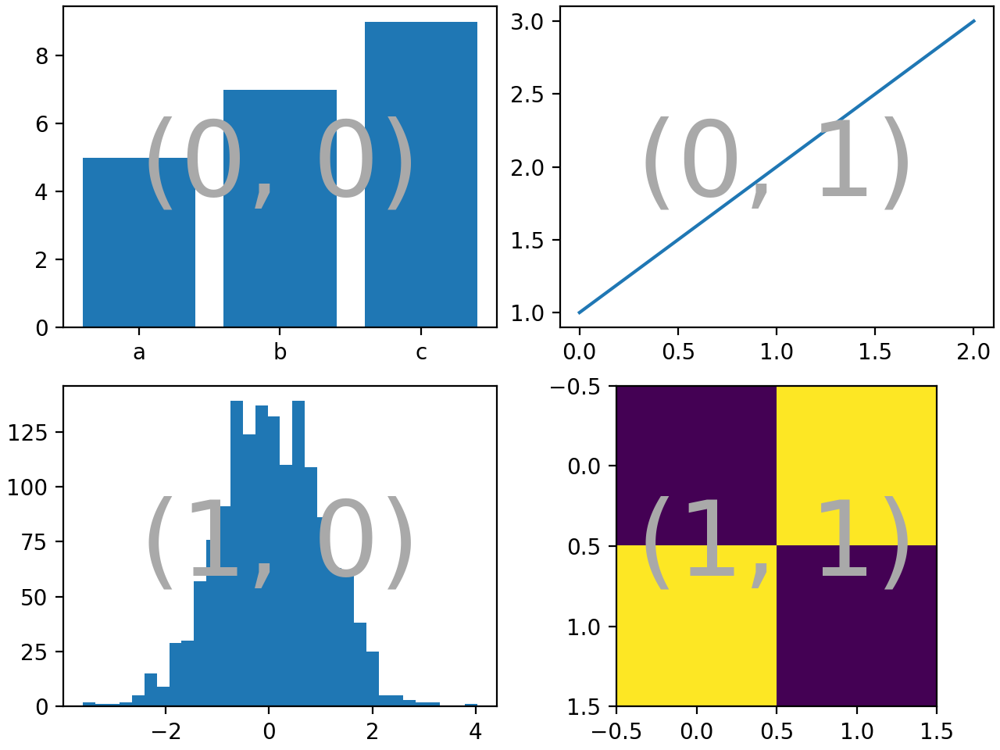
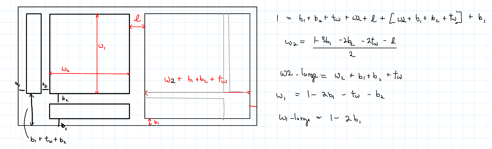

## Software Systems and Operation


### Advanced Matplotlib Layouts with the `bisect()` function

<!-- I can put a figure here from my notability note titled "Why i need bisect function" -->

It can be difficult to create complex plot layouts with matplotlib, especially when the layout should have strict requirements, like neighboring axes that are aligned with one another. Before explaining a custom method for solving this problem through the use of a new function `bisect()`, its worth reviewing the more accepted methods of advanced matplotlib figure layout. 


#### Subplot Mosaic

[Subplot mosaic](https://matplotlib.org/stable/gallery/subplots_axes_and_figures/mosaic.html)  is a tool for specifying the layout of a figure with a special python dictionary, demonstrated by this example from the docs:

```python


def this_is_function(my_list):
    ls = []
    for item in my_list:
        ls.append(item)
    return ls


fig = plt.figure(layout="constrained")
ax_dict = fig.subplot_mosaic(
    [
        ["bar", "plot"],
        ["hist", "image"],
    ],
)
ax_dict["bar"].bar(["a", "b", "c"], [5, 7, 9])
ax_dict["plot"].plot([1, 2, 3])
ax_dict["hist"].hist(hist_data)
ax_dict["image"].imshow([[1, 2], [2, 1]])
identify_axes(ax_dict)
```



```{=html}
??? note

    There also is a method for embedding one mosaic inside of another, which can be handy for complex layouts:

    ```python
    inner = [
        ["inner A"],
        ["inner B"],
    ]

    outer_nested_mosaic = [
        ["main", inner],
        ["bottom", "bottom"],
    ]
    axd = plt.figure(layout="constrained").subplot_mosaic(
        outer_nested_mosaic, empty_sentinel=None
    )
    identify_axes(axd, fontsize=36)
    ```
```

There are methods of changing the aspect ratios of the plots, but tools for imposing alignment constraints across plots are limited. For example, notice in the example above how the (1,1) plot axes are not vertically aligned with the (0,1) plot above. 

#### Gridspec

[Gridspec](https://matplotlib.org/stable/gallery/lines_bars_and_markers/scatter_hist.html#sphx-glr-gallery-lines-bars-and-markers-scatter-hist-py) is a tool for more carefully specifying a grid layout. Space between plots can be specified, and the relative widths or heights of columns and rows can be customized. Gridspec offers a lot of control, but it requires many custom parameters that can be unintuitive to derive. 


#### Add_axes
One of the simplest ways of adding subplots to a figure is with the `fig.add_axese(rect)` method. The `rect = [ll_x, ll_y, width, height]` specifies the x and y coordinate of the lower left corner with the first two parameters, and the width and height with the second 2 parameters. Multiple uses of `add_axese()` offers maximum control for creating advanced layouts, but specifying all the correct `rect` arrays can get very confusing. Figure @Fig:layout_sketch illustrates the types of calculations that become necessary when the specific location and size of each subplot must be specified under certain constraints. 

{#fig:layout_sketch short-caption="Rough sketch for layout with add_axese()"}


#### `bisect()` method


<script src="../../chapter_05/code/section_05.js"></script>