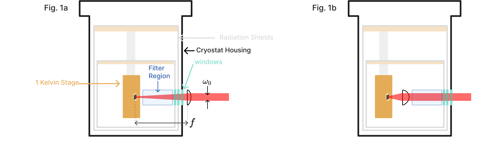

## Aph 138 Homework Assignment
<script src="../../chapter_05/code/section_05.js"></script>

<!-- the html tag makes this only appear on the website -->
```{=html}
<button style="display: block; margin-left: auto; margin-right: auto" class="md-button md-button--primary">Toggle Visibility of Homework Solutions</button></td>
```
<!-- This span is processed by  pandoc-latex-color so that the color of the pdf will change also. -->
<span class=blue>Contact [Andrew Mueller](mailto:andrewstermueller@gmail.com) with any questions about the homework or solution manual. The solutions to some sections specify finer-grained point values when there are multiple answers per section. As the grader, feel free to use these or not. </span>

### 1. Free space coupling with low dark counts (50 points)
An experimental apparatus emits a collimated beam of $1550~\mathrm{nm}$ photons with gaussian beam waist $w_0 = 3~\mathrm{mm}$. You wish to focus the beam onto an SNSPD directly through a window in a cryostat. 

{#fig:cryostat_concept short-caption="Cryostat concept designs."}

As we will see later on, a set of filters will be needed between the detector and the window to minimize dark counts. In practice, the set of filters can be quite thick. Say a $f = 100 mm$ lens is used right outside the cryostat to focus the beam onto the detector though a set of filters (Fig 1a). The long focal length makes room for a few inches of filters between the external lens and focused spot. 

<!-- This is a link to [The cryostat](./#fig:cryostat_concept) -->

a) (4 pts) If the detector has a circular active area with radius \SI{5}{\micro\metre}, what ratio of power in the beam can it collect? Assume the detector has unity efficiency across all angles of incidence with respect to the surface normal. 

<span class=blue markdown>
    Answer: The divergence angle of the guassian beam: $\theta = \tan^{-1}({\frac{3}{100}})$. 
    The formula for divergence angle in terms of waist $w_0$: $\theta = \frac{\lambda}{\pi w_0}$ 
    Combining and plugging in, the waist radius at focus is  $\frac{\SI{1550}{\nano\metre}}{\pi \tan^{-1}(\frac{3}{100})} \approx 16.5~ \unit{\micro\metre}$ 
    The formula for power inside an aperture at w(z) for a guassian beam: 

    $$P(r, z)=P_{0}\left[1-e^{-2 r^{2} / w^{2}(z)}\right]$$ 

    We are interested in the ratio of power collected at $w(z=0) = w_0$ which may be expressed as: 

    $$P(r, z=0)=1-e^{-2 r^{2} / w_0^{2}}$$ 
    
    Plugging in: 
    $$P(r, z=0)=1-e^{-2(5^{2}) / 16.5^{2}} \approx  \boxed{0.17} $$ 
</span>