## Aph 138 Homework Assignment

In March of 2022, Matthew Shaw was a guest lecturer for the Quantum Hardware and Techniques course (APh/Ph 138b). The following is a homework assignment I wrote to accompany his series of lectures. 

The first problem is inspired by the low dark count rate publication[@Mueller:21]. It has the student build a simple model for a dark count rate transmitted through a series of filters. Finally, it leads the student to consider an ultimate tradeoff between dark count rate and coupling efficiency to wide bandwidth optical signals. A filtering system that only transmits a very narroband signal will not be able to detect ultra-short optical signals with high efficiency or temporal resolution. 

The second problem explores a potential use case of a photon number resolving SNSPD. It closely follows logic presented in an Andreas Christ and Christine Silberhorn paper[@Andreas:12]. I studied this paper earlier in my PhD, when I considered developing a multiplexed single photon source. It turned out that project was overly ambitious, but future PhD students might consider approaching it again. 

<!-- the html tag makes this only appear on the website -->
<!-- if you don't use the {=html} syntax, then the inside of the div would be rendered in the latex document -->
```{=html}
<button style="display: block; margin-left: auto; margin-right: auto" class="md-button md-button--primary">Toggle Visibility of Homework Solutions</button></td>
```
<!-- This span is processed by  pandoc-latex-color so that the color of the pdf will change also. -->
<span class=blue>Contact [Andrew Mueller](mailto:andrewstermueller@gmail.com) with any questions about the homework or solution manual. The solutions to some sections specify finer-grained point values when there are multiple answers per section. As the grader, feel free to use these or not. </span>

### 1. Free space coupling with low dark counts (50 points)
An experimental apparatus emits a collimated beam of $1550~\mathrm{nm}$ photons with gaussian beam waist $w_0 = 3~\mathrm{mm}$. You wish to focus the beam onto an SNSPD directly through a window in a cryostat. 

{#fig:cryostat_concept short-caption="Cryostat optical coupling"}

As we will see later on, a set of filters will be needed between the detector and the window to minimize dark counts. In practice, the set of filters can be quite thick. Say a $f = 100~\mathrm{mm}$ lens is used right outside the cryostat to focus the beam onto the detector though a set of filters (@Fig:cryostat_concept a). The long focal length makes room for a few inches of filters between the external lens and focused spot. 

<!-- This is a link to [The cryostat](./#fig:cryostat_concept) -->

1. (4 pts)
If the detector has a circular active area with radius $5~\mathrm{\upmu m}$, what ratio of power in the beam can it collect? Assume the detector has unity efficiency across all angles of incidence with respect to the surface normal. 

    <span class=blue markdown> **Answer:** </span>
    <span class=blue markdown> The divergence angle of the guassian beam: $\theta = \tan^{-1}({\frac{3}{100}})$. </span>

    <span class=blue markdown>  The formula for divergence angle in terms of waist $w_0$: $\theta = \frac{\lambda}{\pi w_0}$ </span>

    <span class=blue markdown>  Combining and plugging in, the waist radius at focus is $\frac{1550~\mathrm{nm}}{\pi \tan^{-1}(\frac{3}{100})} \approx 16.5~ \mathrm{\upmu m}$ </span>


    <span class=blue markdown> The formula for power inside an aperture at $w(z)$ for a guassian beam:</span>

    <div class=blue markdown >

    $$P(r, z)=P_{0}\left[1-e^{-2 r^{2} / w^{2}(z)}\right]$$ 

    </div>

    <span class=blue markdown>We are interested in the ratio of power collected at $w(z=0) = w_0$ which may be expressed as:</span>
    <div class=blue markdown> 

    $$P(r, z=0)=1-e^{-2 r^{2} / w_0^{2}}$$

    </div>

    <span class=blue markdown>Plugging in: </span>
    <div class=blue markdown> 

    $$P(r, z=0)=1-e^{-2(5^{2}) / 16.5^{2}} \approx  \boxed{0.17} $$

    </div>

2. (4 pts) A faster lens mounted much closer to the detector inside the cryostat focuses to a smaller waist. Consider an $f = 18~\mathrm{mm}$ lens with the detector at the focal length (@Fig:cryostat_concept b). Verify more than 99% of the collimated light will be focused onto the active area of the detector.  


    <span class=blue markdown> The waist radius at focus is  $\frac{1550~\mathrm{nm}}{\pi \tan^{-1}(\frac{3}{18})} \approx 2.98~\mathrm{\upmu m}$ </span>


    <span class=blue markdown>Ratio of power within the $10~\mathrm{\upmu m}$ radius active area: </span>
    <div class=blue markdown> 

    $$P(r, z=0)=1-e^{-2(5^{2}) / 2.98^{2}} \approx \boxed{0.996} $$

    </div>

    Without filtering, the mid-infrared photons coupled to the detector from the room temperature laboratory are a dominant source of dark counts. Think of the environment outside the window as an isotropic blackbody emitter. Consider 3 cases, where the shaded red regions illustrate the light field of thermal radiation that could couple to the detector:

    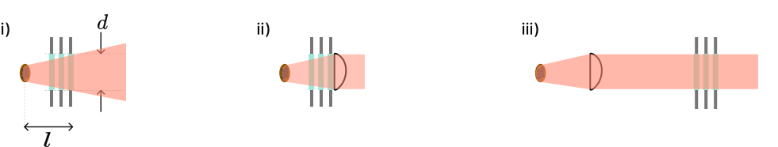{#fig:coupling_options short-caption="Cryostat coupling options"}

    i) There is no lens; the detector is distance $l$ inside the cryostat, and the first window with diameter $d$ defines an entrance pupil. <br>
    ii) Same as (i), but a lens with focal length $l$ is placed right outside the first window. The detector is at the focal point. <br>
    iii) Same as (ii) but the lens is placed inside the cryostat with the detector still at the focal length. Equivalent to @Fig:cryostat_concept b above. <br>

3. (6 pts) Does (ii) couple more, less, or equal dark counts to the detector than (i)? What about case (iii)? Why? No calculations should be needed. 
(Hint: Consider the units of radiance, which characterizes a black body emitter. Etendue or beam parameter product may be useful concepts to consider) 

    <span class=blue markdown> **Answer:** </span>
    <span class=blue markdown> The three cases couple the same amount of light to the detector. (ii) couples the same amount of power as (i) because a blackbody source can't be focused to higher intensity with a lens. The solid angle subtended by the entrance pupil as seen by the detector is the same in all cases. The detector area stays the same as well so the etendue is conserved across all three cases. This implies the same radiant power is coupled. </span>

    <span class=red markdown> 3 points for saying all situations couple the same rate; 3 points for some explanation. </span>

4. (9 pts) Using Planck's law  with laboratory temperature $T$ and the geometry of case (i) above, write an expression for spectral radiant flux (photons per unit wavelength) on the active area of a detector with radius $r$. 

    <span class=blue markdown> **Answer:** </span>
    <span class=blue markdown>The expression is a product of several factors:</span>
    
    <div class=blue markdown> 

    $$\text{Flux}[\lambda] = P \Omega D_{area} B_{\lambda}(\lambda, T)$$

    </div>

    <span class=blue markdown> Where $P = \frac{\lambda}{hc}$ is the number of photons per unit energy, $\Omega$ is the solid angle of blackbody radiation as seen by the detector, $D_{area} = \pi r^2$ is the area of the detector, and $B_{\lambda}$ is Planck's law. </span>
    <span class=blue markdown>Planck's law:</span>
    <div class=blue markdown> 

    $$B_{\lambda}(\lambda, T)=\frac{2 h c^{2}}{\lambda^{5}} \frac{1}{e^{h c /\left(\lambda k_{\mathrm{B}} T\right)}-1}$$

    </div>

    <span class=blue markdown> $\Omega = \pi \sin{\theta^2}$, where $\theta = \tan^{-1}(\frac{(d/2)}{l})$ is the half angle of the field of view of blackbody radiation as seen by the detector. </span>

    <span class=blue markdown>The full expression: </span>
    <div class=blue markdown> 

     $$\text{Flux}[\lambda] = \frac{\lambda \pi^2 r^2 \sin{\theta^2}}{hc} \frac{2 h c^{2}}{\lambda^{5}} \frac{1}{e^{h c /\left(\lambda k_{\mathrm{B}} T\right)}-1}, \,\,\,\,\,\,\,\,\,\,\,\theta = \tan^{-1}(\frac{(d/2)}{l})$$

     </div>
     
     <span class=blue markdown> Since the expression asked for can be written many ways, just verify the student has taken into account all the terms in equation (1) above, and has the correct expressions for</span> <span class=red markdown>$\Omega$ (3 pts), $\theta$ (3 pts), and P (3 pts).</span>

5. (6 pts) Consider the configuration in Fig. 1b).  The detector has an internal quantum efficiency approximated by: 

    $$\eta(\lambda) = \frac{1}{2}(1 - \text{erf}[\lambda - 3~\mathrm{\upmu m}]) $$

    $\lambda$ is measured in $\mathrm{\upmu m}$ and $\text{erf}()$ is the error function. Using your conclusions from (1.3) and expression from (1.4), write a formula $N_{photons}[\lambda]$ for the number of detectable dark counts with respect to $\lambda$, then numerically integrate it to find the dark count rate with no filtering. The laboratory temperature $T$ is 293 K, lens focal length $l$ is $18~\text{mm}$, detector radius $r$ is $5~\mathrm{\upmu m}$, and the diameter $d$ of all optics is 1 inch. The maximum count rate of this SNSPD is 10 MHz. Is the detector usable or overexposed? 

    <span class=blue markdown> **Answer:** </span>
    <span class=blue markdown>Use the expression from (1.4) and multiply it by the quantum efficiency function $\eta(\lambda)$ </span>
        
    <div class=blue markdown> 

    $$N_{photons}[\lambda] = P \Omega D_{area} \eta(\lambda) B_{\lambda}(\lambda, T=293)$$

    </div>

    <span class=blue markdown>  Here is the function expressed in mathmatica and the solution to the integral: </span>

    <span class=blue markdown>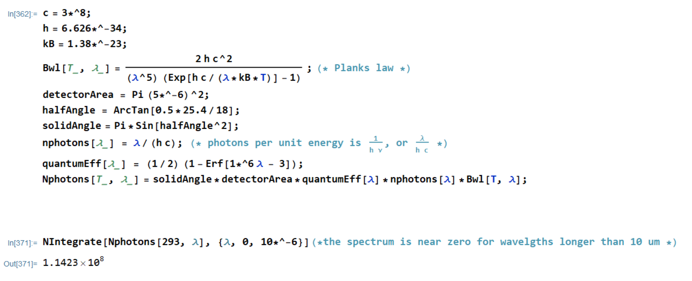</span>

    <span class=blue markdown>Dark count rate $\approx \boxed{110 \,\text{MCounts/s}}$ </span>
    <span class=blue markdown>The rate of dark counts exceeds the usual maximum count rate, the detector is not usable. </span>

    <span class=red markdown>3 pts. for similar dark count rate (+/- 20%) , 3 pts. for saying the detector is not usable.</span>

6. (6 pts) A set of shortpass filters can remove the bulk of blackbody radiation. A shortpass filter can be roughly modeled with the formula:

    $$F(\lambda, E_t) = \frac{1}{E_t}[(E_t - 1)H(\lambda_c - \lambda) + 1]$$

    Where H is the Heaviside step function, $\lambda_c$ is the cutoff wavelength of the filter, and $E_t$ is the extinction ratio of the filter. Use this with $N_{photons}[\lambda]$ from (d). How many filters with $\lambda_c = 1560~\text{nm}$ and $E_t = 30~\text{dB}$ are necessary to suppress the spectral region of detectable dark counts longer than 1560 nm so that it is not the dominant source of dark counts?

    <span class=blue markdown> **Answer:** </span>

    <span class=blue markdown>$\boxed{\text{3 filters}}$ are needed to make the wavelength band shorter than 156 nm the dominant source of counts.</span> <span class=red markdown>3 pts. for this answer</span>

    <span class=red markdown>3 pts for evidence:</span>
    <span class=blue markdown>Students might integrate the detectable dark count spectrum with different numbers of filters and comparing the results. The computations below show the addition of a fourth filter has a negligible effect on the dark count rate. </span>
    
    <span class=blue markdown>Students may instead give a more qualitative answer, for example with a graph of the filtered spectrums, that shows the relative suppression of the region longer than 1560 nm. </span>

    <span class=blue markdown>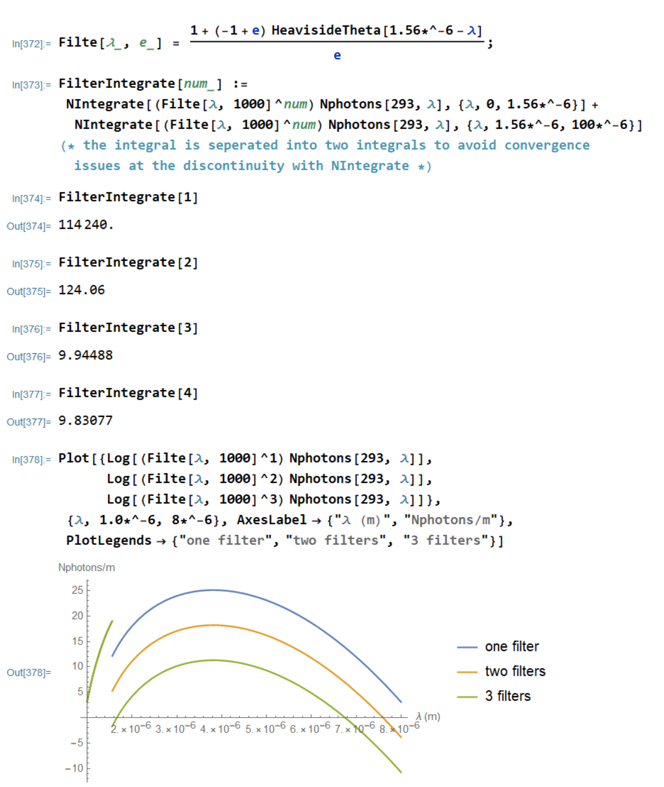</span>

7. (7 pts)  If a narrow band filter is also inserted with center wavelength $1550~\text{nm}$ and spectral width below $1-2~nm$, then dark count rate can be approximated as just $N_{photons}[\lambda = 1550~\text{nm}]$ times the filter width. Show for this wavelength range you can simplify dark count rate further to a simple exponential function. If the laboratory air conditioner breaks, raising the lab temperature from 293 K to 300 K, how much higher is the dark count rate?

    <span class=blue markdown> **Answer:** </span>

    <span class=blue markdown>The expression for $N_{photons}[\lambda]$ from part (1.4) can be simplified and evaluated at 1550 nm, then multiplied by the filter width in nanometers. </span>

    <div class=blue markdown>

    $$\begin{aligned}
    N_{photons}[\lambda] &= P \Omega D_{area} \eta(\lambda) B_{\lambda}(\lambda) \\
    N_{filter} &= N_{photons}[\lambda = 1550~\text{nm}]\Delta \lambda
    \end{aligned}$$

    </div>

    <span class=blue markdown>This code shows integrating the spectrum and just multiplying $N_{photons}$ times the filter width produce very similar results (for a 1 nm filter):</span>

    <span class=blue markdown>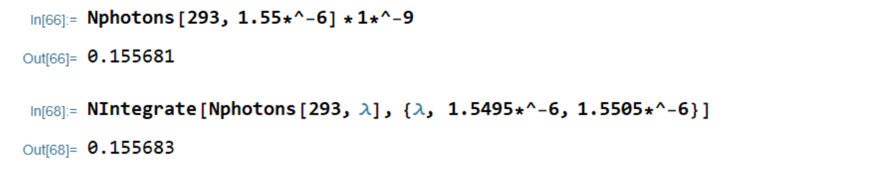</span>


    <span class=blue markdown>Evaluating the $N_{photon}$ function at $\lambda = 1550~text{nm}$ shows the $-1$ term is small relative to the exponential term:</span>

    <span class=blue markdown>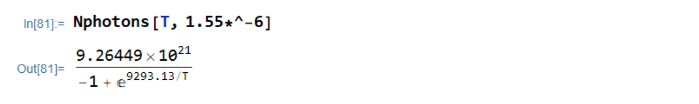</span>

    <span class=blue markdown>Therefore the filter transmission approximation is:</span>
    <div class=blue markdown> 

    $$\boxed{N_{filter} \approx 9.26\mathrm{e}21 \Delta\lambda e^{-9290/T} (\frac{\text{photons}}{\text{s*meter}})}$$

    </div>

    <span class=blue markdown>or equivalently: </span>
    <div class=blue markdown> 

    $$\boxed{N_{filter} \approx 9.26\mathrm{e}12 \Delta\lambda e^{-9290/T} (\frac{\text{photons}}{\text{s*nm}})}$$

    </div>

    <span class=blue markdown>and the dark count rate in the 300 K room is roughly double the rate in the 293 K room: </span>

    <span class=blue markdown></span>

    <span class=red markdown>4 pts for a similar equation, 3 pts for finding the dark count rate roughly doubles. </span>

    A quantum communication experiment requires time-tagging photons with respect to a 50 GHz clock with 95% fidelity. That is, 95% of the timing measurements of detected photons emitted at the same time with respect to a clock fall within a 20 ps bin. Say the detector and readout electronics have a combined jitter of 10 ps FWHM, and a mode locked laser is used for the experiment that generates transform-limited Gaussian pulses. You tune it's temporal length to a value for which the total timing uncertainty of time-tagged photons — including system jitter and pulse temporal length — matches the 95 % fidelity at 50 GHz requirement. Assume detector jitter has a Gaussian shape as well.

8. (8 pts) Find the spectral width of a filter that would transmit 95% of the photons from the mode locked laser. What is the dark count rate with this filter, using the expression from (1.7) and T = 293 K?

    <span class=blue markdown> **Answer:** </span>

    <span class=blue markdown>For transform limited guassian pulses, the product of temporal and spectral width at a FWHM level is [about 0.441](https://www.lasercalculator.com/transform-limited-pulse-calculator/). There's a derivation of this [here](https://www.physicsforums.com/threads/time-bandwidth-product-ideal-mode-locking.171404/post-1339948), but students don't need to show it. </span>

    <div class=blue markdown> 

    $$T B P_{\text {Gaussian }}=\frac{2 \log 2}{\pi} \approx 0.441$$

    </div>

    <span class=blue markdown> Since this uses the FWHM level, all the 95% metrics need to be converted. About 95% of the area under a guassian falls within $\pm 2 \sigma$. </span>

    <span class=blue markdown> Bound on total system timing uncertainty: $20~\text{ps}_{95\%} = (20/4)*2.35 = 11.75~\text{ps}_{FWHM}$ </span>

    <span class=blue markdown> The jitter of the detection system and the temporal width of the laser pulse $\Delta t$ should add in quadrature to match the bound: </span>

    <div class=blue markdown> 

    $$ 11.75~\text{ps}_{FWHM} = \sqrt{ \Delta t^2 + (10~\text{ps})^2}$$

    </div>

    <div class=blue markdown> 

    $$ 0.441 = \Delta t \Delta \nu $$
    $$\Delta \nu = 71~\text{GHz}$$
    $$\Delta \lambda = \frac{\lambda^2 \Delta \nu}{c} = 0.57~\text{nm}$$

    </div>

    <span class=blue markdown> $0.57~\text{nm}$ is the spectral width of the laser pulse at the FWHM level. If this pulse passes through a tophat filter with width equal to the 95\% level of the laser pulse, then 95\% will be transmitted. </span>

    <span class=blue markdown>Filter width: </span>
    <div class=blue markdown> 

    $$\Delta \lambda_{95\%} = \frac{4 \Delta \lambda}{2.35} \approx \boxed{1~\text{nm}} $$

    </div>

    <span class=blue markdown>Dark count rate is easy to find using the expression from the previous section: </span>

    <div class=blue markdown> 

    $$\boxed{N_{filter} \approx 9.26e12 (1~\text{nm}) e^{-9290/T} (\frac{\text{photons}}{\text{s*nm}})} \approx 0.15~\text{photons/s} $$

    </div>

    <span class=red markdown>3 points for writing and solving the equation that matches the jitter bound to the quadrature sum </span>
    <span class=red markdown>5 points for correct filter width and dark count rate</span>

### 2. SPDC Coupling and Single Photon Sources (50 points)
An Spontaneous Parametric Down Conversion (SPDC) crystal is known to generate a twin beam squeezed state of the form: 

$$|\psi\rangle= \sqrt{1 - \gamma^2} \sum_{n=0}^{\infty} \gamma^{n}\left|n_{s}, n_{i}\right\rangle $$

Where $n_s$ and $n_i$ are the number of photons corresponding to the signal and idler parts of the wavefunction. Consider @fig:hsps a, where the crystal is pumped with a pulsed laser, and the the signal and idler components that emerge are separated either by polarization or frequency. The idler arm is sent to an SNSPD. This configuration can be used as a heralded single photon source (HSPS). A click on the detector on the idler arm `heralds' a non-vacuum state in the signal arm. High fidelity and probability single photon sources are very useful for various quantum optics experiments and technologies, including linear optical quantum computing. 

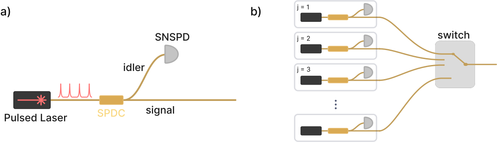{#fig:hsps short-caption="Heralded single photon source designs"}

Most SNSPDs are *binary*-type single photon detectors, meaning they differentiate between zero and one or more photons arriving in a given light pulse. A positive operator value measure (POVM) quantifies how a `click' from a binary SPD updates our knowledge of the incident state: 

$$\hat{\Pi}_{\text {binary}} = \sum_{n=0}^{\infty}\left[1-(1-\eta)^{n}\right]|n\rangle\langle n|$$

Where $\eta$ is the coupling efficiency between state of interest and the detector. 

1. (6 pts) Find the expectation value of $\hat{\Pi}_{\text {binary}}$ given the SPDC state above. This is the probability $p_{binary}\left(\gamma, \eta\right)$ of getting a binary detector click on the idler arm. For $\gamma << 1$, what is $p_{binary}$ up to lowest order in $\gamma$, and what fock state of the signal arm is the source of this dominant term? 

    <span class=blue markdown> **Answer:** </span>

    <div class=blue markdown> 

    $$\begin{align}
    \langle \psi | \Pi_{\text {binary}} | \psi \rangle &= (1- \gamma^2) \sum_{\tilde{n}=0}^{\infty} \langle \tilde{n}_s \tilde{n}_i | \gamma^{\tilde{n}} \sum_{n=0}^{\infty}[1 - (1-\eta)^{n}] \gamma^n | n_s n_i \rangle \\
    \langle \psi | \Pi_{\text {binary}} | \psi \rangle &= p_{binary}(\gamma, \eta) =  \boxed{(1-\gamma^2) \sum_{n_s=0}^{\infty} \gamma^{2n_s} [1 - (1 - \eta)^{n_s}]}
    \end{align}$$

    </div>

    <span class=blue markdown> For $\gamma << 1$, $p \sim (1 - \gamma^2)[\cancel{\gamma^0[1 - (1 - \eta)^0]} + \gamma^{2}\eta ] \sim (1 - \gamma^2)\gamma^{2}\eta$ </span>

    <span class=blue markdown> To lowest order in $\gamma$, $p \sim \gamma^{2}\eta$. The single photon fock state dominates for $\gamma << 1$. </span>

    <span class=red markdown> 3 pts for correct $p_{binary}(\gamma, \eta)$; 3 pts for saying the leading term is from single photons </span>

 2. (6 pts) A general form for the density matrix of the signal mode given a herald event is:

    $$\rho_{s}\left(\gamma, \eta\right)=\frac{\operatorname{Tr}_{i}\left(\hat{\Pi}|\psi\rangle\langle\psi|\right)}{\left\langle\psi\left|\hat{\Pi}\right| \psi\right\rangle}$$

    Write down the $|1\rangle\langle1|$ term of this matrix, and simplify any infinite sums. This is the single photon fidelity $F_{binary}(\gamma, \eta)$. Why does $F_{binary}$ approach zero for $\gamma$ approaching 1? What types of states is the SPDC generating in this limit?  

    <span class=blue markdown> **Answer:** </span>

    <div class=blue markdown> 

    $$\begin{align}
    \rho_s(\gamma,\eta) &= \frac{\operatorname{Tr}_i[\cancel{(1 - \gamma^2)}\Sigma_{n=0}^{\infty} \gamma^{2n}[1 - (1 - \eta)^{n} ]| n \rangle \langle n | n_s n_i \rangle \langle n_s n_i |]}
    {\cancel{(1-\gamma^2)} \sum_{n_s=0}^{\infty} \gamma^{2n_s} [1 - (1 - \eta)^{n_s}]}\\
    |1_s \rangle \langle 1_s | &= \frac{\gamma^2[1 - (1 - \eta)]}{\sum_{n_s=0}^{\infty} \gamma^{2n_s} [1 - (1 - \eta)^{n_s}]} = \frac{\gamma^2 \eta}{\sum_{n_s=0}^{\infty} \gamma^{2n_s} [1 - (1 - \eta)^{n_s}]}\\
    |1_s \rangle \langle 1_s | &= \frac{\gamma^2 \eta}{\sum_{n_s=0}^{\infty}(\gamma^{2n_s} - [\gamma^2 (1 - \eta)]^{n_s})}\\
    &= \frac{\gamma^2 \eta}{\frac{1}{1 - \gamma^2} - \frac{1}{1 - \gamma^2(1 - \eta)}}\\
    &= \frac{\gamma^2 \eta (1 - \gamma^2)}{1 - \frac{1 - \gamma^2}{1 - \gamma^2(1 - \eta)}}\\
    &= \frac{\cancel{\gamma^2 \eta} (1 - \gamma^2) (1 - \gamma^2 (1 - \eta))}{\cancel{1 - \gamma^2 (1 - \eta) - 1 + \gamma^2}} \\
    F_{binary}(\gamma, \eta) &= \boxed{(1 - \gamma^2)(1 - \gamma^2(1 - \eta))}
    \end{align}$$

    </div>

    <span class=blue markdown>As $\gamma$ approaches 1, the denominator in the original expression for $\rho_s(\gamma,\eta)$ approaches infinity while the numerator approaches $\eta$. In this limit, the SPDC is generating predominantly multi-photon states. For $\gamma$ approaching 1, the probability of the generated state being a single photon state goes to zero. Because the binary POVM was used, multi-photon states are 'included' in $\rho_s(\gamma,\eta)$. For  $\rho_s$ from the PNR POVM shown below, multi-photon states will be included to a much lesser extent, depending on the value for $\eta$.</span>

    <span class=red markdown>3 pts for correct $F_{binary}(\gamma, \eta)$; 3 pts for similar explanation</span>

    An HSPS with high single photon fidelity and probability is most useful, but you see these metrics are maximized for opposite limits of $\gamma$. One approach to achieving high probability and fidelity simultaneously is to link multiple SPDC sources and heralding detectors as shown in @Fig:hsps b. A click from the detector $j$ triggers the switch to move to position $j$ and let the heralded state pass through. This way, $\gamma$ for each source can be kept low to maximize fidelity, while heralding probability increases with the number of sources.

2. (6 pts) If such a multiplexing setup is engineered to have 98\% single photon fidelity from each source and 98\% heralding probability overall, how many sources and binary SNSPDs are needed? Use an idler arm efficiency $\eta$ of 80\%.

    <span class=blue markdown> **Answer:** </span>

    <span class=blue markdown>The fist step is to determine the pump power $\gamma$ for which fideltiy is 98\%. </span>

    <div class=blue markdown>

    $$0.98 = F_{binary}(\gamma, \eta) = (1 - \gamma^2)(1 - \gamma^2(1 - \eta)\,\,\,\,\,\,\,\, \eta = 0.8$$

    </div>

    <div class=blue markdown> A numerical solution is fine. We're interested in the positive solution less than one:</span>

    <span class=blue markdown>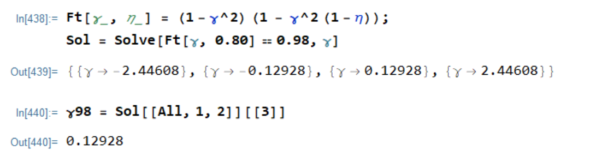</span>

    <span class=blue markdown>Like in introductory statistics problems, its helpful to think about the negative case: Given N sources with herald probability $p$, the probability of zero sources heralding is:</span>

    <div class=blue markdown>

    $$P(\text{no herald}|N) = (1 - p_{binary}\left(\gamma, \eta\right))^N$$

    </div>

    <span class=blue markdown>Then the probability of at least one herald is 1 minus the previous expression:</span>
    <div class=blue markdown>

    $$P(\text{at least one herald}|N) = 1 - (1 - p_{binary}\left(\gamma, \eta\right))^N$$

    </div>

    <span class=blue markdown>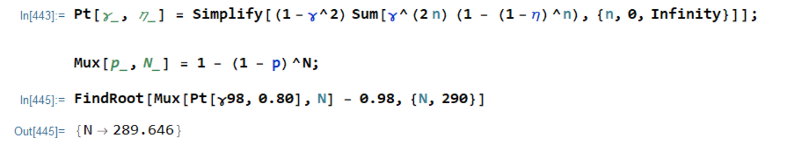</span>

    <span class=blue markdown>About $\boxed{N = 290}$ sources are needed.</span>

    <span class=red markdown>3 pts for correct form of the multiplexing expression
    $P(\text{at least one herald}|N)$; 3 pts for similar number of sources $N$</span>

    A photon number resolving (PNR) SNSPD is able to discriminate the number of photons in a light pulse. By heralding the idler mode with a PNR SNSPD, the generation of multi-photon signal pulses can be identified and discarded. There's a POVM for an ideal PNR single photon detector, where $i$ is the number of photons detected:

    $$\hat{\Pi}_{PNR}(i)=\sum_{n=i}^{\infty}\binom{n}{i}(1-\eta)^{n-i} \eta^{i}|n\rangle\langle n|$$


3. (12 pts) Derive a herald probability $p_{PNR}$ and fidelity $F_{PNR}$ for the PNR POVM, following the steps in the previous sections with $i$ set to 1. You can use symbolic math tools to simplify them if you wish. The probability of successfully heralding states in the signal arm $p_{PNR}$ should now approach zero for $\gamma$ near one. Why is this? 
   
    <span class=blue markdown> **Answer:** </span>
    <span class=blue markdown>The POVM for one photon detected:</span>

    <div class=blue markdown>

    $$\hat{\Pi}_{PNR}(1)=\sum_{n=1}^{\infty}n(1-\eta)^{n-1} \eta|n\rangle\langle n|$$

    </div>

    <span class=blue markdown>First, derive the probability of getting a single photon detection from the PNR detector: $p_{PNR}(\gamma, \eta)$:</span>

    <div class=blue markdown>

    $$\begin{align}
        p_{PNR}(\gamma, \eta) =\langle \psi | \Pi_{\text {PNR}} | \psi \rangle &= (1- \gamma^2) \sum_{\tilde{n}=0}^{\infty} \langle \tilde{n}_s \tilde{n}_i | \gamma^{\tilde{n}} \sum_{n=1}^{\infty}n(1-\eta)^{n-1} \eta|n\rangle\langle n| | n_s n_i \rangle \\
        \langle \psi | \Pi_{\text {PNR}} | \psi \rangle &= p_{PNR}\left(\gamma, \eta\right) =  \boxed{(1-\gamma^2) \sum_{n_s=0}^{\infty} \gamma^{2n_s} n_s(1-\eta)^{n_s-1}}\\
        p_{PNR}\left(\gamma, \eta\right) &=  \boxed{\frac{\gamma ^2 (1 - \gamma ^2) \eta }{(\gamma ^2 (\eta -1)+1)^2}}
    \end{align}$$

    </div>

    <span class=blue markdown>Where either of the boxed answers are acceptable, and the last line was found using mathematica:</span>

    <span class=blue markdown>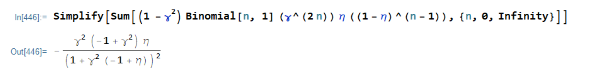</span>

    <span class=red markdown>4 pts for $p_{PNR}\left(\gamma, \eta\right)$</span>

    <span class=blue markdown>Second, derive the single photon fidelity, staring with the density matrix for the signal photon given a PNR herald event. Using (15) above for $\langle \psi | \Pi_{\text {PNR}} | \psi \rangle$ in the denominator helps simplify it significantly. </span>

    <div class=blue markdown>

    $$\begin{align}
        \rho_s(\gamma,\eta) &= \frac{\operatorname{Tr}_i[\sum_{n=1}^{\infty} \gamma^{2n}n(1-\eta)^{n-1} \eta|n\rangle\langle n|n_s n_i \rangle \langle n_s n_i |]}
            {\langle \psi | \Pi_{\text {PNR}} | \psi \rangle}\\
            |1_s \rangle \langle 1_s | &= \frac{\cancel{(1 - \gamma^2)}(\gamma ^2 (\eta -1)+1)^2 \cancel{\gamma^2 \eta}}{\cancel{\gamma^2 \eta} \cancel{(1 - \gamma ^2)} }\\
            F_{PNR}(\gamma, \eta) &= \boxed{(\gamma ^2 (\eta -1)+1)^2}
    \end{align}$$

    </div>

    <span class=red markdown>4 pts for $F_{PNR}(\gamma, \eta)$</span>

    <span class=blue markdown>For $\gamma$ near one, the SPDC is under strong pump power and is generating predominantly multi-pair states. A vanishing fraction of those states are single photon states that the PNR detector is able to distinguish and single-photon. Therefore, the PNR detector is signaling the generation of multi-pair states most of the time which should be discarded and do not contribute to $p_{PNR}$. For high efficiency $\eta$, only the vanishing single-pair creation rate contributes predominantly to $p_{PNR}$.</span>

    <span class=red markdown>4 pts for similar explanation</span>

4. (12 pts) Make a parametric plot for $0<\gamma<1$ with $F_{PNR}$ on the x-axis and $p_{PNR}$ on the y-axis. Plot the curve for a few different values of idler arm efficiency $0<\eta<1$. All curves should reach the same maximum herald probability. What is it? 
   
    <span class=blue markdown> **Answer:** </span>
    <span class=blue markdown>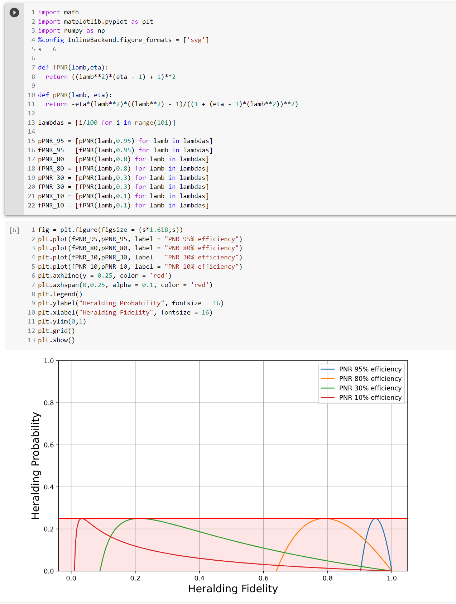</span>

    <span class=blue markdown> The the herald probability regardless of idler arm efficiency is 25\%. </span>

    <span class=red markdown> 4 points for the 25\% limit; 8 points for a few plots at different $\eta$ </span>

5. (8 pts) Consider again the configuration in @Fig:hsps b. Find the number of sources using PNR detectors needed to reach 98\% single photon herald probability and fidelity with $\eta = 0.8$. Also find the number of sources for $\eta = 0.95$.

    <span class=blue markdown> **Answer:** </span>
    <span class=blue markdown>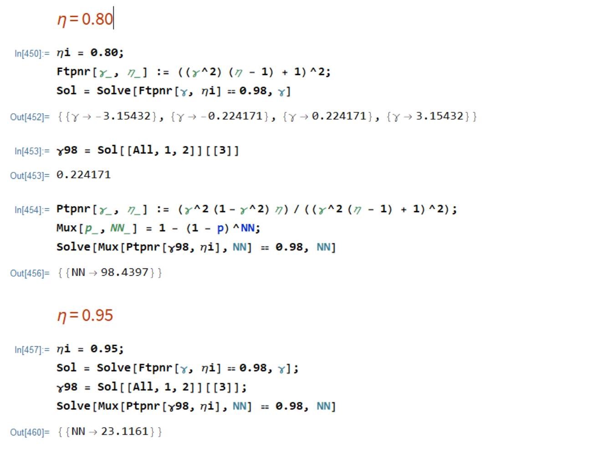</span>

    <span class=blue markdown>About $\boxed{\text{98 sources are needed for the case with an 80% heralding}}$, </span>
    <span class=blue markdown>about $\boxed{\text{23 sources are needed with 95% efficient heralding}}$</span>

    <span class=red markdown> 4 points for each of the 2 answers. Answers that vary from these values by 2-3 sources are acceptable. </span>


<!-- Keep at end of the page! -->
<script src="../../chapter_05/code/section_05.js"></script>