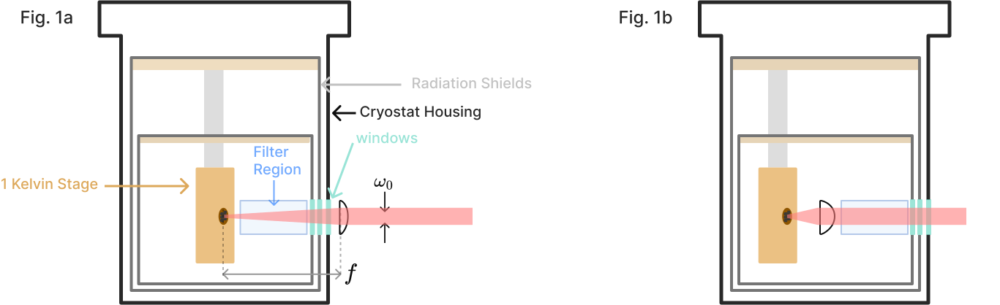

## Aph 138 Homework Assignment


<!-- the html tag makes this only appear on the website -->
<!-- if you don't use the {=html} syntax, then the inside of the div would be rendered in the latex document -->
```{=html}
<button style="display: block; margin-left: auto; margin-right: auto" class="md-button md-button--primary">Toggle Visibility of Homework Solutions</button></td>
```
<!-- This span is processed by  pandoc-latex-color so that the color of the pdf will change also. -->
<span class=blue>Contact [Andrew Mueller](mailto:andrewstermueller@gmail.com) with any questions about the homework or solution manual. The solutions to some sections specify finer-grained point values when there are multiple answers per section. As the grader, feel free to use these or not. </span>

### 1. Free space coupling with low dark counts (50 points)
An experimental apparatus emits a collimated beam of $1550~\mathrm{nm}$ photons with gaussian beam waist $w_0 = 3~\mathrm{mm}$. You wish to focus the beam onto an SNSPD directly through a window in a cryostat. 

{#fig:cryostat_concept short-caption="Cryostat optical coupling"}

As we will see later on, a set of filters will be needed between the detector and the window to minimize dark counts. In practice, the set of filters can be quite thick. Say a $f = 100~\mathrm{mm}$ lens is used right outside the cryostat to focus the beam onto the detector though a set of filters (Fig 1a). The long focal length makes room for a few inches of filters between the external lens and focused spot. 

<!-- This is a link to [The cryostat](./#fig:cryostat_concept) -->

a) (4 pts) If the detector has a circular active area with radius $5~\mathrm{\upmu m}$, what ratio of power in the beam can it collect? Assume the detector has unity efficiency across all angles of incidence with respect to the surface normal. 

<span class=blue markdown> Answer: The divergence angle of the guassian beam: $\theta = \tan^{-1}({\frac{3}{100}})$. </span>

<span class=blue markdown>  The formula for divergence angle in terms of waist $w_0$: $\theta = \frac{\lambda}{\pi w_0}$ </span>

<span class=blue markdown>  Combining and plugging in, the waist radius at focus is $\frac{1550~\mathrm{nm}}{\pi \tan^{-1}(\frac{3}{100})} \approx 16.5~ \mathrm{\upmu m}$ </span>


<span class=blue markdown> The formula for power inside an aperture at $w(z)$ for a guassian beam:</span>

<div class=blue markdown >

$$P(r, z)=P_{0}\left[1-e^{-2 r^{2} / w^{2}(z)}\right]$$ 

</div>

<span class=blue markdown>We are interested in the ratio of power collected at $w(z=0) = w_0$ which may be expressed as:</span>
<div class=blue markdown> 

$$P(r, z=0)=1-e^{-2 r^{2} / w_0^{2}}$$

</div>

<span class=blue markdown>Plugging in: </span>
<div class=blue markdown> 

$$P(r, z=0)=1-e^{-2(5^{2}) / 16.5^{2}} \approx  \boxed{0.17} $$

</div>

(4 pts) A faster lens mounted much closer to the detector inside the cryostat focuses to a smaller waist. Consider an $f = 18~\mathrm{mm}$ lens with the detector at the focal length (@Fig:cryostat_concept (B)). Verify more than 99% of the collimated light will be focused onto the active area of the detector.  


<span class=blue markdown> The waist radius at focus is  $\frac{1550~\mathrm{nm}}{\pi \tan^{-1}(\frac{3}{18})} \approx 2.98~\mathrm{\upmu m}$ </span>


<span class=blue markdown>Ratio of power within the $10~\mathrm{\upmu m}$ radius active area: </span>
<div class=blue markdown> 

$$P(r, z=0)=1-e^{-2(5^{2}) / 2.98^{2}} \approx \boxed{0.996} $$

</div>

Without filtering, the mid-infrared photons coupled to the detector from the room temperature laboratory are a dominant source of dark counts. Think of the environment outside the window as an isotropic blackbody emitter. Consider 3 cases, where the shaded red regions illustrate the light field of thermal radiation that could couple to the detector:

{#fig:coupling_options short-caption="Cryostat coupling options"}

<div markdown>
            i) There is no lens; the detector is distance $l$ inside the cryostat, and the first window with diameter $d$ defines an entrance pupil. 
</div>
<div markdown>
            ii) Same as (i), but a lens with focal length $l$ is placed right outside the first window. The detector is at the focal point. 
</div>
<div markdown>
            iii) Same as (ii) but the lens is placed inside the cryostat with the detector still at the focal length. Equivalent to @Fig:cryostat_concept (B) above. 
</div>


<!-- Keep at end of the page! -->
<script src="../../chapter_05/code/section_05.js"></script>
