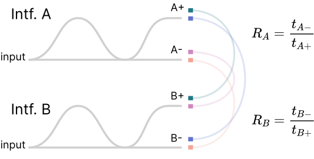

<!-- 

<span class="html">Table [1](#table:maximum_rates)</span><span class="latex"> table \ref{table:maximum_rates}</span>

 -->

## Phase basis readout

This section uses numbers in kets to signify time delays, such that the notation from the main text transforms as $|e\rangle, |l\rangle \longrightarrow |0\rangle, |1\rangle$. Following the creation of the bell pair $\frac{1}{\sqrt{2}}(|00\rangle + e^{i \phi}|11\rangle)$ with the source interferometer, the readout interferometers at Alice and Bob transform each member of the entangled pair according to the operation [@Marcikic2002]:

$$|k\rangle \rightarrow \frac{1}{2}\left(|k\rangle_{(A/B)+}+e^{i \phi_{s / i} \mid}|k+1\rangle_{(A/B)+}+i|k\rangle_{(A/B)-}-i e^{i \phi_{s / i}}|k+1\rangle_{(A/B)-}\right)$$

Where $(A/B)+$ and $(A/B)-$ denote the output ports of Alice ($A$) or Bob's ($B$) interferometer. The full state is a 28-term expression made of four so-called 'branches' indexed by the four combinations of interferometer output ports: $A+ B+, A+ B- A- B+$ and $A- B-$. Each branch has a term in the following form, with amplitude dependent on the phase relationship between the interferometers:

$$p\left(e^{i \phi}+qe^{i\left(\phi_s+\phi_i\right)}\right)|2\rangle_{Au}|2\rangle_{Bv} $$

Where $p, q, u, v \in \{\{+1,+1, +, +\}, \{i,-1, +, -\}, \{i,-1, -, +\}, \{-1,+1, -, -\}\}$ for the four terms. These terms define the probability amplitude of the quantum state in the so-called phase basis. The modulous squared of these terms gives the phase-dependent probability of coincidences across the center time bins, as measured at interferometer outputs of Alice and Bob. 

All the phase terms can be grouped into one variable $\theta = \phi_s + \phi_i - \phi$, and the four $|2\rangle|2\rangle$ terms can be re-expressed in terms of the the cosine function [@Marcikic2002; @Kim2022]:

$$ \begin{align}
P_{A+ B+} &= |\langle 2|2\rangle|^2_{A+ B+} = 2(1 + v \cos(\theta)) \\
P_{A+ B-} &= |\langle 2|2\rangle|^2_{A+ B-} = 2(1 - v \cos(\theta)) \notag \\
P_{A- B+} &= |\langle 2|2\rangle|^2_{A- B+} = 2(1 - v \cos(\theta)) \notag \\
P_{A- B-} &= |\langle 2|2\rangle|^2_{A- B-} = 2(1 + v \cos(\theta)) \notag \\ \notag
\end{align}
$$ {#eq:cosines}


where $v$ was added to denote the visibility of the phase basis. Scanning the phase of the system and measuring coincidence rate across the center bins produces sinusoidal fringes as shown in @fig:fringes. 


## Coincidence Rate \& Interferometer Output Ports 

As each readout interferometer has two output ports, the full output state observed at Alice and Bob cannot be fully measured with two SNSPDs. We label the output ports of Alice (A) and Bob's (B) interferometers with plus ($+$) and minus ($-$). The plus ports are used for most measurements. By measuring the relative loss between the plus and minus ports, all singles rates $S_i$ and coincidence rates $C_{ij}, i,j \in \{A+, A-, B+, B-\}$ across different detectors can be estimated. 

$R_A$ is the ratio of transmissions $t_{A-}$ over $t_{A+}$, where $t_{A-}$ is the transmission through the input to output $A-$ and $t_{A+}$ is the transmission through the input to output $A-$. $R_B$ is defined analogously. We measure values for $R_A$ and $R_B$ by sending a pulsed laser into the input and measuring the ratio of power transmitted across the output ports:

$$R_A = 0.99 \pm 0.03, ~~~~~~ R_B = 1.04 \pm 0.03$$

<!-- \begin{figure}[H]
    \centering
    \includegraphics[width=0.5\linewidth]{Interferometer_Output_Schematic_R_Eq.pdf}
    % \caption{}
    % \label{fig:branches}
\end{figure} -->

{#fig:branches short-caption='Wavefunction branches' width=70% path="chapter_05"}

The coincidence rates for all wavefunction branches are the same if $\theta$ in @eq:cosines is set to zero. With this phase state rate $C_{A+ B+, \theta=0}$ measured directly (labeled B in \ref{fig:fringes}), it's straightforward to estimate the full wavefunction coincidence rate across all interferometer outputs. As shown in table @table:rates, the rate is $C_{A+ B+}(1 + R_A + R_B + R_AR_B)$. This estimate is used to express a full coincidence rate for figures 3 and 4 in the main text. 

<div class="latex">
\definecolor{color1}{HTML}{38A5BA}
\definecolor{color2}{HTML}{6275CE}
\definecolor{color3}{HTML}{D088BF}
\definecolor{color4}{HTML}{F4A596}
\begin{table}
\label{table:branches}
\begin{tabular}{ |p{2.5cm}||p{1.3cm}|p{2.9cm}|p{2.9cm}|p{3.4cm}|  }
\hline
\multicolumn{5}{|c|}{Predicted Singles and Coincidence Rates for Full Wavefunction} \\
\hline
rate metrics     &  Branch 1 & Branch 2 & Branch 3 & Branch 4 \label{table:rates}\\
\hline
singles rate 1  & $S_{A+}$ &$S_{A-}=R_A S_{A+}$    &$S_{A+}$               &$S_{A-}=R_A S_{A+}$        \\
singles rate 2  & $S_{B+}$ &$S_{B+}$               &$S_{B-} = R_B S_{B+}$  &$S_{B-} = R_B S_{B+}$      \\
coincidence rate&\textcolor{color1}{$C_{A+B+}$}&\textcolor{color3}{$C_{A-B+}=R_A C_{A+B+}$}&\textcolor{color2}{$C_{A+B-}=R_B C_{A+B+}$}&\textcolor{color4}{$C_{A-B-}=R_B R_A C_{A+B+}$}\\
\hline
\end{tabular}
\caption[{Rates for wavefunction branches}]{Singles and coincidence rates for wavefunction branches. The $A+, B+$ branch was measured, and the rates of other branches are predicted using relative transmission factors $R_A, R_B$}
\end{table}
</div>
```{=html}
$$
\definecolor{color1}{RGB}{56, 165, 186}
\definecolor{color2}{RGB}{98, 117, 206}
\definecolor{color3}{RGB}{208, 136, 191}
\definecolor{color4}{RGB}{244, 165, 150}
$$
<div style="text-align: center;">
<a name='table:branches'></a>
<span style="font-size: 17px;">Predicted Singles and Coincidence Rates for Full Wavefunction</span>
</div>
<table style="margin: 0" markdown>
| rate metrics | Branch 1 | Branch 2 | Branch 3 | Branch 4 |
| --- | --- | --- | --- | --- |
| singles rate 1 | $\small{S_{A+}}$ | $\small{S_{A-}=R_A S_{A+}}$ | $\small{S_{A+}}$ | $\small{S_{A-}=R_A S_{A+}}$ |
| singles rate 2 | $\small{S_{B+}}$ | $\small{S_{B+}}$ | $\small{S_{B-} = R_B S_{B+}}$ | $\small{S_{B-} = R_B S_{B+}}$ |
| coincidence rate | ${\color{color1}\small{C_{A+B+}}}$ | ${\color{color3}\small{C_{A-B+}=R_A C_{A+B+}}}$ | ${\color{color2}\small{C_{A+B-}=R_B C_{A+B+}}}$ | ${\color{color4}\small{C_{A-B-}=R_B R_A C_{A+B+}}}$ |
<figcaption markdown>**Rates for wavefunction branches** Singles and coincidence rates for wavefunction branches. The $A+, B+$ branch was measured, and the rates of other branches are predicted using relative transmission factors $R_A, R_B$ </figcaption>
</table>
```

For main-text figure 2 in particular, coincidences were measured with the center bin rate tuned to a minimum $\theta=-\frac{\pi}{2}$ (grey solid line in main-text figure 2c). The rate therefore captures the contribution from the 6 phase-independent terms for the $A\!\!+\!\!B\!+\!$ wavefunction branch. This can be extrapolated to the $\theta=0$ state by multiplying by $\frac{4}{3}$. For the rate displayed to be consistent with the measures of coupling efficiency $\eta$ (and so the interferometers aren't thought of as a source of $\sim$ 50\% loss), this rate is multiplied again by $(1 + R_AR_B)$ to represent two wavefunction branches. This results in a total scaling of: 

$$C_{fig. 2} = \frac{4}{3}(1 + R_AR_B)C_{measured}$$


## Joint Spectral Intensity Analysis


This entanglement source is potentially useful for future quantum communication systems that make use of two-photon interference, such as teleportation or entanglement swapping. These require the generation of highly pure and indistinguishable photons. The type-0 SPDC crystal used in this source shows strong spectral correlations that make it inappropriate for two-photon interference demonstrations by itself. However, with the application of the DWDM filtering, we create a series of spectral channel pairings that are potentially good individual sources of fairly pure single mode photons. To investigate this, we model the joint spectral intensity function (JSI) produced by the SPDC and fit it to data. Then we and apply a Schmidt decomposition to the spectral modes produced when pairs of DWDM filter channels are applied to the modeled JSI. We derive an inverse Shmidt number which is equal to single photon purity $P$ as well as visibility $V$ of Hong-Ou-Mandel (HOM) interference. An inverse Schmidt number approaching 1 indicates that the source is effective for two-photon interference measurements like HOM and Bell State measurements. 

### JSI modelling

We follow an analysis for co-linear quasi-phase matching inside a waveguide packaged SPDC crystal \cite{Davis2022, ZielnickiKwiat2018SPDCmodel}. The joint spectral intensity $|f(\omega_s, \omega_i)|^2$  is modelled as a product of phase matching and pump envelope intensities |$\psi_{\mathrm{ph}}\left(\omega_s, \omega_i\right)|^2$ and $|\psi_p\left(\omega_s, \omega_i\right)|^2$, where $\omega_s$ and $\omega_i$ are the frequencies of the signal and idler models respectively. The phase matching envelope intensity takes the form:
$$\left|\psi_{\mathrm{ph}}\left(\omega_s, \omega_i\right)\right|^2=\operatorname{sinc}^2\left(\frac{\Delta k L}{2}\right),\;\;\;\;\;\; \Delta k=2 \pi\left(\frac{n\left(\lambda_p\right)}{\lambda_p}-\frac{n\left(\lambda_s\right)}{\lambda_s}-\frac{n\left(\lambda_i\right)}{\lambda_i}-\Gamma\right)$$
where $L$ is the length of the crystal, $\Delta K$ is a wave-vector mismatch term, and $n_{p(s)(i)}$ is the refractive index of the crystal at the wavelengths of pump $\lambda_p$, signal $\lambda_s$ and idler $\lambda_i$. $\Gamma = 1/\Lambda$ where $\Lambda$ is the polling period of the crystal. The refractive indices $n(\{\lambda_p, \lambda_s, \lambda_i\})$ are computed from an MgO-doped PPLN Sellmeier equation \cite{Gayer2008}. In the expression for $\Delta K$, $\lambda_p$ is the function of $\lambda_s$ and $\lambda_i$ that imposes energy conservation: $1/\lambda_p = 1/\lambda_s + 1/\lambda_i$. 
% $$s\frac{1}{\lambda_p} = \sfrac{1}{\lambda_s} + \sfrac{1}{\lambda_i}$$


The pump envelope intensity is modeled as
$$|\psi_p\left(\omega_s, \omega_i\right)|^2=\exp \left(-\frac{\left(\omega_p-\omega_s-\omega_i\right)^2}{\sigma_p^2}\right)$$ where $\omega_p$ and $\sigma_p$ are the center frequency and bandwidth of the pump signal out of the EDFA/SHG module. Unlike $\lambda_p$ in the phase matching expression above, $\omega_p$ and $\sigma_p$ are fixed to known values or chosen as floating fitting parameters. 

### JSI fitting
The JSI model is fitted to the the 8x8 DWDM data from Fig.~2a in the main text. The transmission spectrum of one DWDM channel was measured and used to estimate the transmission properties for all pairs of 8 channels. For each measurement of coincidence rate from Fig.~2a we define an integration over the joint spectral intensity and the corresponding filter passbands:

\begin{align}
    C_{u,v} = \int_{s}\int_{i}T_u(\lambda_s)T_v(\lambda_i)|f(\omega_s, \omega_i)|^2 d\lambda_s d\lambda_i \label{C_uv}
\end{align}

where $T_{u(v)}$ is the transmission spectrum for filter with ITU channel $u (v)$, and the integrations are over the signal and idler wavelengths. Efficiency parameters $\eta_i$ scale the DWDM filter spectrums, and are used to model all loss between pair generation in the SPDC crystal and detection in the SNSPDs. To fit the $\eta_i$ values, the singles rates from Fig.~2a were also included, and fitted to single-filter integrations:

$$S_{u} = \int_{s}\int_{i}T_{u}(\lambda_a)|f(\omega_s, \omega_i)|^2 d\lambda_s d\lambda_i$$

Where $a \in \{i, s\}$. Parameters of model for $|f(\omega_s, \omega_i)|^2$ were optimized to minimize the error between estimates $C_{u,v}$ and $S_u$ and the measured coincidence and singles rates. The following parameters were either set explicitly based on measurements and known constants (black), or optimized in the fitting process (blue):

\begin{figure}[H]
    \centering
    \includegraphics[width=1\linewidth]{fitting_parameters.pdf}
    \caption{Pump laser $\lambda$ and $sigma$ were found by measuring the output of the SHG module with a spectrum analyzer. }
    \label{fig:parameters}
\end{figure}


Varying MgO doping percentage and varying crystal temperature affect the Sellmeier equations in similar ways \cite{Gayer2008, Jundt1997}. Therefore, crystal temperature $T$ was used as a fitting parameter, to stand in the unknown MgO doping percentage. The true crystal temperature during all measurements was $50.0^{\circ}~\mathrm{C}$, which was optimized to maximize coincidence rates.

%  The waveguide/crystal used was 10 mm long, but we allow the effective length $L_g$ to converge to a shorter value. This is because we expect non-negligible group velocity mismatch $GVM = 1/n(\omega_p) - 1/n(\omega_{s(i)})$ that with the short (2 ps) pump pulse results in a shorter effective interaction length $L_g$ \cite{SchoberThesis2005}. We therefore accept some temporal broadening of the down-converted pulses in exchange for the higher conversion efficiency of a 10 mm crystal


\begin{figure}[H]
    \centering
    \includegraphics[width=0.9\linewidth]{JSI_sim_results.pdf}
    \caption{a) \& b) For type-0 SPDC, the relationship between refractive indices of pump and down-converted wavelengths produces an intensity profile roughly parallel with the pump envelope. This is responsible for the broad output spectrum of these crystals. c) the coincidence rates in Kcounts/s that are fit to filter-defined integrations of the JSI. d) Joint spectral distributions of coincidences expected from the filter pairings that correspond to the main diagonal. Here the joint spectrums of 8 DWDM channels pairs are shown summed together, where each component of the sum is an expression like the integrand of $C_{u,v}$ above. }
    \label{fig:jsi_sim}
\end{figure}

An ideal photon pair source for scalable optical quantum information processing would not exhibit joint spectral correlations between the signal and idler photons. The Schmidt decomposition, which is equivalent to the singular value decomposition in our computational model, can be used to quantify these correlations \cite{ZielnickiKwiat2018SPDCmodel}. We apply the Schmidt decomposition to the filtered JSIs for filter pairings along the main diagonal in Fig.~2a in the main text, and derive the inverse Schmidt number for these modes
$$1/K = \sum_i \lambda_i^2$$
where $\lambda_i$ are the Schmidt coefficients \cite{ZielnickiKwiat2018SPDCmodel}. The inverse Schmidt numbers for all 8 channel pairs are similar, and are not expected for vary due to any phenomena beyond inaccuracies of the model. Therefore, we quote single values for $1/K$ in the main text. 

## Consequences of Narroband Filtering
### Calculation of mean photon number per pulse \texorpdfstring{$\mu$}{(mu)}

\begin{figure}[H]
    \centering
    \includegraphics[width=1\linewidth]{filter_considerations_light.pdf}
    \caption{a) Two filters with bandwidth approximately 0.04 nm are applied to the JSI model. True coincidences are expected only from the region inside the small red square. b) The shape of the JSI with one 100 GHz DWDM filter applied c) the JSI a 100 GHz DWDM filter applied on both signal and idler arms. }
    \label{fig:narroband}
\end{figure}

It is common in the literature to calculate signal and idler arm efficiencies with equations of the form:
\begin{align}
\eta_{s(i)}=\frac{C_{s i}}{S_{i(s)}} \label{regular_eff}
\end{align}
Where $\eta_{s(i)}$ is coupling efficiency of the signal (idler) arm, $C_{s i}$ is the coincidence rate, and $S_{i(s)}$ is the singles rate on the idler (signal) arm. $\mu$, the mean pair rate per period or cycle, may also be defined in terms of the repetition rate $R$ as $R \mu \eta_{s(i)}=S_{s(i)}$. With these, one can define $\mu$ in terms of coincidence rate $C_{s i}$ and singles rates $S_s$ and $S_i$:
\begin{align}
    \mu=\frac{S_s S_i}{C_{s i} R} \label{eq:colorless}
\end{align}
However, this definition breaks down in the limit of narroband filtering, or when the losses on the signal and ider arm cannot be thought of as 'colorless'. Consider the situation of two very-narroband filters, as illustrated in figure \ref{fig:narroband}a. This situation can be simulated using the JSI model. We set signal and idler filter bandwidth to 5\% of the 100 GHz DWDM bandwidths. Pump power is scaled by 200x. Transmission of the filters at their maximum is set to 100\%. This results in $S_s = 58.0~\mathrm{MHz}$, $S_i = 57.6~\mathrm{MHz}$, and $C_{s i} = 567~\mathrm{KHz}$. With these values, eq. \ref{eq:colorless} suggests a $\mu$ value of 1.47. This is misleading because it's unreasonable to expect the red outlined region at the intersection of the filters in \ref{fig:narroband}a --which is responsible for all true detections of entangled pairs-- to be the source of more than one entangled pair per pulse. Rather, the high singles rates $S_s$ and $S_i$ are having an adverse effect on the $\mu$ calculation. Most of the singles detections are from mutually incompatible spectral modes -- the 4 regions that form a cross shape above, below, and to the sides of the red outlined square. 

We propose a definition of $\mu$ similar to the form of eq. \ref{C_uv}:
\begin{align}
    \mu_{u,v} = \frac{1}{R}\int_{s}\int_{i}W_u(\lambda_s)W_v(\lambda_i)|f(\omega_s, \omega_i)|^2 d\lambda_s d\lambda_i \label{newmu}
\end{align}
where $W_u$ and $W_v$ have the spectrums of filters $T_u$ and $T_v$ but maximum transmissions of 100\%. This is an integration of $|f(\omega_s, \omega_i)|^2$ over the bipartite spectral region where filter transmission is non-negligible. As the JSI model is defined, $|f(\omega_s, \omega_i)|^2$ has units of entangled pairs per $\mathrm{nm}^2$.

Going forward, we use the eq. \ref{newmu} definition of $\mu$ in the main text, and do a separate analysis of the effect of the mutually incompatible spectral modes when necessary. Note that in the main text, Alice receives idler photons and Bob receives signal photons, so variables transform as $C_{is} \rightarrow C_{AB}$, $S_{i} \rightarrow S_{A}$, and $S_{s} \rightarrow S_{B}$

### Estimating \texorpdfstring{$\mu$}{mu} from coincidence and singles rates

As eq. \ref{eq:colorless} is problematic for the narroband filtering regime, a conversion is needed that maps this type of expression to the more implicitly defined \ref{newmu}. Luckily, the influence of narroband filtering as a sort of pseudo-loss can be rolled into a new geometric factor $\delta$. This is the ratio of the JSI captured by two narroband spectral filters $W_u(\lambda_s)*W_v(\lambda_i)$ to that captured by one $W_v(\lambda_i)$, as illustrated in \ref{fig:narroband}b and c. Consider an expression for $\delta$ in terms of measured and fitted quantities:
\begin{align} 
\delta_{i(s)} = \frac{C_{is}}{\eta_{i(s)}S_{s(i)}} \label{new_eff}
\end{align}
Here, $S_{s(i)}$ is the singles rate through a signal (idler) narrowband filter. $\eta_{i(s)}S_{s(i)}$ would be the coincidence rate if the idler (signal) filter was wide-band (or just colorless loss), but maintained the same efficiency as measured ($\eta_{i(s)}$). Therefore the fraction can be thought of as the ratio of a coincidence rate measurement with two narroband filters $[C_{is}]$ to a coincidence rate measurement with one narro-band and one wide-band filter $[\eta_{i(s)}S_{s(i)}]$. As we use the same bandwidth filters on the signal and idler arms, the $\delta_i$ and $\delta_s$ calculated from the measured data and JSI fitting results are similar. We use an averaged single $\delta$ value for all further analysis, unique to our JSI bandwidth and 100 GHz DWDM filters. 
$$\delta = 0.393 \pm 0.012$$
This is averaged from 8 $\delta_i$ and 8 $\delta_s$ values, for the 8 DWDM channel pairs along the main diagonal of the JSI. 

We see eq. \ref{new_eff} is a modified form of \ref{regular_eff} that includes $\delta$. With $R \mu \eta_{s(i)}=S_{s(i)}$ again, we can define a new expression for $\mu$ using singles $S_{s(i)}$ and coincidence $C_{is}$ rates. 
\begin{align}
    \mu = \frac{\delta S_s S_i }{R C_{is}} \label{new_mu}
\end{align}
This is used to compute $\mu$ in the main text. 

% - say that in the limit of super narrowband filtering, you'd end up in this situation where the coincidence rate would be super low relative to the singles rate. Show how with the existing equations you'd get a silly situation where your model would imply mean photon number above 1. 

% - Say that doesn't really match with the 'role' that $\mu$ is supposed to play in the calculations. 

% - Instead, we calculate $\mu$ for a 


## Quantum State Tomography

We perform quantum state tomography of individual channel pairs in order to resolve the full density matrix and calculate bounding terms for the distillable entanglement rate. 

Established methods for tomography of time-bin entangled photon pairs involve independent phase control of the two readout interferometers. However, the center bin coincidence rate depends on an overall phase which is the sum of source and readout interferometer phases (see @eq:cosines). By manipulating the overall phase through control of only one interferometer, we assume that the full phase-dependent behavior of the system is captured. The data for the tomography is captured with Alice's interferometer in 3 phase settings. That which minimizes coincidence rate of the center bin (labelled A in \ref{fig:fringes}), that which maximizes coincidences in the center bin (C), and a state halfway between in phase (B). The (B) state is chosen by setting the interferometer power to a value halfway between the power settings for states A and C. We therefore assume phase scales linearly with power, which is supported by the good agreement in \ref{fig:fringes} between the phase fringes and a cosine fit. 

\begin{figure}[H]
    \centering
    \includegraphics[width=0.8\linewidth]{fringes_light.pdf}
    \caption{Coincidence rate across center time bin with respect to interferometer power. The fringe data was measured for the two output ports of Alice's interferometer. The output port 1 data was fitted to a cosine curve using linear least squares.}
    \label{fig:fringes}
\end{figure}

Multiple measurements involving all three time bins are performed with the phase set in these 3 states. The columns labeled A, B, and C in \ref{fig:counts_chart} correspond to these 3 measurement conditions, where the measurements for the 90 degree phase measurements are repeated in columns 2 and 3. We organize the coincidence data in this format to show how it relates to more canonical constructions of tomography data where the phases of the two readout stations are controlled independently \cite{Zhang2021Tomography,Takesue09Tomography}. Summing the counts in each row yeilds a 16-element vector which is sufficient to calculate a density matrix using a maximum likelyhood method \cite{tomography2023}. 

\begin{figure}[H]
    \centering
    \includegraphics[width=1\linewidth]{Chart_1.pdf}
    \caption{Quantum state tomography data for one low-power (SHG at 1.2 Amps) measurement of channels 35 and 59. The numbers are coincidences per second. Dashes (-) indicate projections that cannot be measured for the particular pairing of time-bin choice (row) and interferometer phase setting (column).}
    \label{fig:counts_chart}
\end{figure}

We use a density matrix to calculate bounds on $E_D$, the distillable entanglement rate. $E_D$ quantifies the rate of maximally entangled Bell pairs which may be created from the received state with local operations and classical communication. $E_D$ is bounded above by log-negativity $E_N$ and below by coherent information ($E_I = \mathrm{max}\{I_{A\rightarrow B}$, $I_{B\rightarrow A}\}$) \cite{Alshowkan2022,Eisert2000} both of which may be calculated from the density matrix:

$$E_N = \mathrm{log_2}||\rho^{A}|| \quad\quad\quad I_{A\rightarrow B} = H\left(\rho^\mathrm{B}\right)-H\left(\rho^{\mathrm{AB}}\right)$$

Where $||\rho^{T_A}||$ is the trace norm of the partial transpose of $\rho$, the calculated bipartite density matrix. $H$ is the base-2 von Neumann entropy \cite{Vidal2002negativity, Devetak2004coherent} 

The entanglement rate of the experiment in ebits/s is the coincidence rate $C_{AB}$ times $E_D$. We therefore plot $C_{AB}E_N = C_N$ and $C_{AB}E_I = C_I$ in the main text as the upper and lower bounds on entangled bit rate $C_{AB}E_D = C_D$. Multiple integrations are performed at each phase and power setting, so that multiple density matrices and multiple measures of coherent information and log-negativity may be derived. The averages and standard deviations of these sets of measurements are used to define the values and error bars for figures 3 and 4 in the main text. 

Figure 3 in the main text also shows a lower bound on secret key rate (SKR) given reasonable assumptions for a slightly different implementation of the entanglement source. This is calculated with a key genration rate formula \cite{ma2007quantum}:

\begin{align}
C_{SKR} &= C_{AB} E_S \\
C_{SKR} &= q C_{AB}[1-f(\mathcal{E}) H_2(\mathcal{E})-H_2(\mathcal{E})]
\end{align}
Where $E_S$ is the secret key fraction, $C_{AB}$ is the raw coincidence rate, $q$ is a basis reconciliation factor, $\mathcal{E}$ is the quantum bit error rate, and $f(x)$ is the bidirectional error correction efficiency. Quantum bit error rate $\mathcal{E}$ is $(1-V)/2$ where $V$ is visibility~\cite{Kim2022}. We choose a constant realistic value for $f(\mathcal{E})$ of 1.1 \cite{ElkoussReconciliation2010}. $H_2(x)$ is the binary entropy formula defined as
$$\mathrm{H}_2(x)=-x \log _2(x)-(1-x) \log _2(1-x).$$
We use a basis reconciliation factor of 0.81, thereby assuming a readout configuration at both Alice and Bob where 90\% of each channel's flux is directed to a z-basis measurement and may be used to build the shared key. The other 10\% is used for phase-basis measurements with the interferometers. 


<!-- \begin{figure}[H]
    \centering
    \includegraphics[width=0.7\linewidth]{density_matrix.pdf}
    \caption{Density matrix data from channels 35 and 59 at 1.2 A SHG pump power. The $|ee\rangle$ state is higher than all other states due to the interferometer imbalances. For the matrix shown here, $E_N = 0.971$ and $I_{A\rightarrow B} = 0.904$}
    \label{fig:density_matrix}
\end{figure} -->

{#fig:density_matrix short-caption='Density matrix at low $\mu$' width=90% path="chapter_05"}


## Impact of experimental imperfections on entanglement visibility

The experiment employs three Michaelson interferometers with a path-length delay of 80 ps: one at the source to generate the early and late time-bins, and one prior to each detector to control the measurement basis. To determine the effect of interferometric imperfections on the entanglement visibility, we model the interferometers as equivalent Mach-Zehnder interferometers as shown in Fig. \ref{fig:interf_model}. Imperfections in the interferometer are captured by the transmittance $t$ of the beamsplitter and internal path (mirror) efficiencies $|\alpha|^2$ and $|\beta|^2$. An ideal Michaelson interferometer has $t = 1/\sqrt{2}$ and $|\alpha|^2 = |\beta|^2  = 1$.
\begin{figure}[h!]
    \centering
    \includegraphics[width=\textwidth]{interf_model.pdf}
    \caption{Model for Michaelson interferometers employed in the experiment. The interfomerter contains a beamsplitter with transmittance $t$ and two mirrors with efficiencies $\alpha$ and $\beta$.}
    \label{fig:interf_model}
\end{figure} 

\subsection{Source Interferometer Imperfections}
In the experiment, pulses of coherent light from a mode-locked laser (MLL) are injected into the input of the source interferometer. A field $\hat{E}$ at the input of the source interferometer transforms as
\begin{align}
    \hat{E}_{\text{in}}  \rightarrow rt \alpha e^{i\varphi} \hat{E}_{E,1} +  r^2 \alpha e^{i\varphi}\hat{E}_{E,2} + rt\beta \hat{E}_{L,1} + t^2\beta \hat{E}_{L,2} + ir\sqrt{1-|\alpha|^2}\hat{E}_{\text{vac}_1} +it\sqrt{1-|\beta|^2}\hat{E}_{\text{vac}_2} \label{eq:source_field_transform}
\end{align}
where the early and late temporal modes are denoted by subscripts "E" and "L", the input and output modes are denoted by subscripts "in", "1" and "2", and $r = i\sqrt{1-|t|^2}$. Due to imperfect path efficiencies, part of the light leaks into the vacuum field mode $\hat{E}_{\text{vac}}$, which corresponds to the last term in Eq. \ref{eq:source_field_transform}. It follows that the power of the early and late output pulses in terms of the power of the input pulse are
\begin{align}
    &P_{E,1} = |r|^2|t|^2|\alpha|^2 P_{in},&P_{E,2} = |r|^4 |\alpha|^2 P_{in} \label{eq:powers}\\
    &P_{L,1} = |r|^2|t|^2|\beta|^2 P_{in} ,&P_{L,2} = |t|^4 |\beta|^2 P_{in}.\nonumber 
\end{align}

%The splitting ratio $|t|^2$ and internal path efficiencies $|\alpha|^2$ and $|\beta|^2$ can be solved from (\ref{eq:powers}).  


% Therefore, the powers $P_1$, $P_2$ measured at output ports 1 and 2 are
% \begin{align}
%     &P_{1} =|t|^2|r|^2(|\alpha|^2+|\beta|^2)P_{in},& P_{2} =(|r|^4|\alpha|^2 + |t|^4 |\beta|^2)P_{in}
% \end{align}
% where $P_i = P_{E,i}+P_{L,i}$ with $i=1,2$. 

To generate the entangled photon pairs, one of the output ports of the source interferometer is up-converted by second harmonic generation (SHG)
then down-converted via spontaneous parametric down conversion (SPDC), resulting in two-mode squeezed vacuum states (TMSVs) in early and late temporal modes with mean photon numbers $\mu_E$ and $\mu_L$, respectively. The ratio of $\mu_E$ to $\mu_L$ depends on which output port of the source interferometer is used. Note that the definition of $\mu$ used in the main text is per source laser period or per experiment cycle (4.09 GHz). Therefore $\mu$ from the main text is equal to $\mu_E + \mu_L$. 
The output power of SHG ($P_{SHG}$) as a function of the SHG pump power ($P_p$) is \cite{parameswaran2002observation},
\begin{align}
    P_{SHG} = P_{p}\tanh^2{\sqrt{\eta_{SHG}P_{p}}} \approx \eta_{SHG}P_{p}^2
\end{align}
where $\eta_{SHG}$ is the conversion efficiency of the SHG crystal.
After SPDC, the squeezing parameter ($\xi$) of the TMSVs in terms of the SPDC pump power ($P_{SHG}$) is $\xi = \lambda \sqrt{P_{SHG}} \approx \lambda \sqrt{\eta_{SHG}}P_p$, where $\lambda$ is proportional to the SPDC crystal length and nonlinear interaction strength \cite{kaiser2016fully}. 
The mean photon number in terms of the squeezing parameter is $\mu = \sinh^2{\xi}\approx \xi^2$. Therefore, the mean photon numbers of the TMSVs as a function of the output pulses of the source interferometer are,
\begin{align}
    &\mu_E \approx \lambda^2 \eta_{SHG} P_{E,i}^2 &\mu_L\approx \lambda^2 \eta_{SHG} P_{L,i}^2
\end{align}
where $i = 1(2)$ corresponds to output port 1(2) of the source interferometer. 


If output port 1 is used, $$\mu_E/\mu_L \approx P_{E,1}^2/P_{L,1}^2 = |\alpha|^4/|\beta|^4,$$ whereas if output port 2 is used,  $$\mu_E/\mu_L \approx P_{E,2}^2/P_{L,2}^2 = |r|^8|\alpha|^4/|t|^8|\beta|^4.$$
When output port 1 of the source interferometer is used, if the internal path efficiencies of the source interferometer are different, there is an imbalance in the early and late mean photon numbers. When output port 2 is used, the effect of the imbalance in the internal path efficiencies on the ratio of early and late mean photon numbers can be compensated by imperfect transmittance: $\mu_E/\mu_L = 1$ when $|t|^2/|r|^2 = |\alpha|/|\beta|$.
% The ratio of early to late mean photon number as a function of source imperfections are shown in Fig. \ref{fig:muEtomuL}. 
% \begin{figure}[h!]
%     \centering
%     \includegraphics[width = \textwidth]{source_mu_ratio.pdf}
%     \caption{Ratio of early and late mean photon numbers ($\mu_E/\mu_L$) as a function of the ratio of interferometric path efficiencies ($|\alpha|^2/|\beta|^2$), for various beamsplitter transmittances $|t|^2 = 0.5$ (red), $0.55$ (blue), $0.6$ (green), $0.65$ (purple). Pulses from port 1 of the source interferometer are used to pump the entangled photon pair source in the experiment, since $\mu_E/\mu_L$ is sensitive to imbalances in the path efficiencies for pulses from port 2.\color{Check for |t|^2<0.5}}
%     \label{fig:muEtomuL}
% \end{figure}

\subsection{Measurement Interferometer Imperfections}
\begin{figure}[h!]
    \centering
    \includegraphics[width=0.8\textwidth]{ent_visib_model.pdf}
    \caption{Setup for theoretical model of entanglement visibility experiment}
    \label{fig:ent_visib_model}
\end{figure}
 Imperfections in the measurement interferometers limit the entanglement visibility of the experiment. As described in the previous section, early and late TMSVs are generated by pumping the SPDC with early and late pulses. Each half of each TMSV is sent to a measurement interferometer (see Fig. \ref{fig:ent_visib_model}). Let $\ket{\xi}$ denote the TMSV state,
\begin{align}
    \ket{\xi} = \sum_{n=0}^{\infty}(-1)^n \sqrt{\frac{\mu^n}{(1+\mu)^{n+1}}}\ket{n_A,n_B}
\end{align}
where $\ket{n_A,n_B}$ denotes the state with $n_A$ photons at the input of interferometer A and $n_B$ photons at the input port of interferometer B. %As in the previous section, $\mu = \sinh^2{\xi}$ is the mean photon number where $\xi$ is the squeezing parameter. 
We model the input state to the measurement interferometers as a product state of TMSV in early and late temporal modes, to lowest order in $\mu_E$ and $\mu_L$:


% \begin{align}
%     \ket{\Psi_{in}} =& \ket{\xi}_E\otimes \ket{\xi}_L \nonumber \\
%     \approx &N\left(\ket{0,0}_E -\mu_E\ket{1,1}_E + \mu_E^2\ket{2,2}_E+\cdots\right)
%     \otimes \left(\ket{0,0}_L -\mu_L\ket{1,1}_L + \mu_L^2\ket{2,2}_L+\cdots\right)\nonumber\\
%     % \approx &N\Big(\ket{0,0}_E\ket{0,0}_L-\mu_E\ket{1,1}_E\ket{0,0}_L-\mu_L\ket{0,0}_E\ket{1,1}_L\\
%     % & + \mu_E^2\ket{2,2}_E\ket{0,0}_L +  \mu_L^2 \ket{0,0}_E\ket{2,2}_L + \mu_E\mu_L\ket{1,1}_E\ket{1,1}_L + \cdots\Big)\nonumber\\
%     =&N\Big(1+\mu_E \hat{a}_{E}^{\dagger}\hat{b}_{E}^{\dagger} + \mu_L \hat{a}_{L}^{\dagger}\hat{b}_{L}^{\dagger} + \mu_E^2 (\hat{a}_{E}^{\dagger})^2(\hat{b}_{E}^{\dagger})^2+\mu_L^2 (\hat{a}_{L}^{\dagger})^2(\hat{b}_{L}^{\dagger})^2 + \mu_E \mu_L \hat{a}_{E}^{\dagger}\hat{b}_{E}^{\dagger} \hat{a}_{L}^{\dagger}\hat{b}_{L}^{\dagger}\Big)\ket{0,0}_E\ket{0,0}_L
% \end{align}

\begin{align}
    \ket{\Psi_{in}} =& \ket{\xi}_E\otimes \ket{\xi}_L \nonumber \\
    = &\left(\frac{1}{\sqrt{1+\mu_E}}\ket{0,0}_E -\sqrt{\frac{\mu_E}{(1+\mu_E)^2}}\ket{1,1}_E +\cdots\right)
    \otimes \left(\frac{1}{\sqrt{1+\mu_L}}\ket{0,0}_L -\sqrt{\frac{\mu_L}{(1+\mu_L)^2}}\ket{1,1}_L +\cdots\right)\nonumber\\
    \approx& \sqrt{1-(\mu_E +\mu_L)}\ket{0,0}_E \ket{0,0}_L -\sqrt{\mu_E}\ket{1,1}_E  \ket{0,0}_L  -\sqrt{\mu_L}\ket{0,0}_E  \ket{1,1}_L\label{eq:input_state}
\end{align}

We can express Eq. \ref{eq:input_state} in terms of the creation operators  $\hat{a}^\dagger$ and $\hat{b}^\dagger$ of the field modes at the inputs of interferometers A and B, respectively:
\begin{align}
    \ket{\Psi_{in}} =\Big(\sqrt{1-(\mu_E+\mu_L)}-\sqrt{\mu_E} \hat{a}_{E}^{\dagger}\hat{b}_{E}^{\dagger} - \sqrt{\mu_L} \hat{a}_{L}^{\dagger}\hat{b}_{L}^{\dagger} \Big)\ket{0,0}_E\ket{0,0}_L \label{eq:input_state_fields}
\end{align}

Since the measurement interferometers are also Michaelson interferometers, the transformation relations are,
\begin{align}
    &\hat{a}_{E} \mapsto r_At_A \alpha e^{i\varphi} \hat{a}_{E,1} + r_A^2 \alpha e^{i\varphi}\hat{a}_{E,2} + r_At_A\beta \hat{a}_{L,1} + t_A^2\beta \hat{a}_{L,2}+c_A\hat{a}_{\text{vac}_1}+d_A\hat{a}_{\text{vac}_2},\label{eq:aE_transform} 
   \\
    &\hat{b}_{E}  \mapsto r_Bt_B \gamma e^{i\varphi} \hat{b}_{E,1} + r_B^2 \gamma e^{i\varphi}\hat{b}_{E,2} + r_Bt_B\delta \hat{b}_{L,1} + t_B^2\delta \hat{b}_{L,2}+c_B\hat{b}_{\text{vac}_1}+d_B\hat{b}_{\text{vac}_2},\label{eq:bE_transform}\\
    &\hat{a}_{L} \mapsto  r_A t_A \alpha e^{i\varphi} \hat{a}_{L,1}  + r_A^2 \alpha e^{i\varphi}\hat{a}_{L,2} + r_A t_A\beta \hat{a}_{L^\prime,1}+ t_A^2\beta \hat{a}_{L^\prime,2}+c_A\hat{a}_{\text{vac}_1}+d_A\hat{a}_{\text{vac}_2},\label{eq:aL_transform}\\
    &\hat{b}_{L}  \mapsto r_B t_B \gamma e^{i\varphi} \hat{b}_{L,1} + r_B^2 \gamma e^{i\varphi}\hat{b}_{L,2}  + r_B t_B\delta \hat{b}_{L^\prime,1}+ t_B^2\delta \hat{b}_{L^\prime,2}+c_B\hat{b}_{\text{vac}_1}+d_B\hat{b}_{\text{vac}_2},\label{eq:bL_transform}\\
    &c_A =ir_A\sqrt{1-|\alpha|^2}, \quad d_A=it_A\sqrt{1-|\beta|^2},\quad
    c_B =ir_B\sqrt{1-|\delta|^2},\quad\ d_B = it_B\sqrt{1-|\gamma|^2},\nonumber
\end{align}
where $L^\prime$ denotes the temporal mode obtained by sending a photon in the late ($L$) mode through the long arm of an interferometer, and $\hat{a}_{\text{vac}_i}$, $\hat{b}_{\text{vac}_i}$ correspond to vacuum modes. To find the state at the output of the interferometers, we combine Eq. \ref{eq:input_state_fields} with Eq. \ref{eq:aE_transform}-\ref{eq:bL_transform}, and consider only terms relevant to post-selection on coincidences of the middle bins (L) of different interferometer outputs, to lowest order in $\mu_E$, $\mu_L$,
\begin{align}
    \ket{\Psi_{\text{out}}}= %&\sqrt{1-(\mu_E+\mu_L)}\ket{0,0;0,0}_E\ket{0,0;0,0}_L\ket{0,0;0,0}_{L^\prime} \\
    \cdots&+r_A^*t_A r_B^*t_B\Big(\beta \delta\sqrt{\mu_E}+\alpha \gamma \sqrt{\mu_L} e^{-2i\varphi}  \Big)\ket{0,0;0,0}_E\ket{1,0;1,0}_L\ket{0,0;0,0}_{L^\prime}\label{eq: output_state}\\
    &+r_A^*t_A\Big(t_B^2  \beta\delta \sqrt{\mu_E} + (r_B^*)^2  \alpha \gamma \sqrt{\mu_L} e^{-2i\varphi}\Big)\ket{0,0;0,0}_E\ket{1,0;0,1}_L\ket{0,0;0,0}_{L^\prime} \nonumber\\
    &+r_B^*t_B\Big(t_A^2\beta \delta\sqrt{\mu_E}  +(r_A^*)^2 \alpha \gamma  \sqrt{\mu_L} e^{-2i\varphi}\Big)\ket{0,0;0,0}_E\ket{0,1;1,0}_L\ket{0,0;0,0}_{L^\prime} \nonumber\\
    &+\Big(t_A^2 t_B^2\beta \delta\sqrt{\mu_E} + (r_A^*)^2 (r_B^*)^2 \alpha \gamma \sqrt{\mu_L} e^{-2i\varphi}\Big)\ket{0,0;0,0}_E\ket{0,1;0,1}_L\ket{0,0;0,0}_{L^\prime} + \cdots \nonumber 
\end{align}


where $\ket{n_{A,1},n_{A_2};n_{B_1}, n_{B,2}}$ denotes the state with $n_{A,1}$ photons at output 1 of interferometer A, $n_{A,2}$ photons at output 2 of interferometer A, $n_{B,1}$ photons at output 1 of interferometer B, and $n_{B,2}$ photons at output 2 of interferometer B. We define the following parameters to simplify notation:
\begin{align}
    x \equiv \frac{\mu_E}{\mu_L},\quad\quad\quad
    \kappa_A \equiv \frac{|\beta|^2}{|\alpha|^2}, \quad\quad\quad \kappa_B \equiv \frac{|\gamma|^2}{|\delta|^2},\quad\quad\quad \epsilon_A = \frac{|t_A|^2}{|r_A|^2}, \quad\quad\quad \epsilon_B \equiv \frac{|t_B|^2}{|r_B|^2}.
\end{align}
From Eq. \ref{eq: output_state}, it follows that the coincidence probabilities for each combination of output ports are proportional to,
% \begin{align}
%     &C_{A_1, B_1}(\varphi) \propto |r_A|^2 |t_A|^2 |r_B|^2|t_B|^2\Big(|\beta|^2|\delta|^2\mu_E+|\alpha|^2|\gamma|^2\mu_L+2|\alpha||\beta||\gamma||\delta|\sqrt{\mu_E \mu_L}\cos{2\varphi}\Big)\\
%     &C_{A_1, B_2}(\varphi) \propto |r_A|^2 |t_A|^2 \Big(|t_B|^4|\beta|^2|\delta|^2\mu_E+|r_B|^4|\alpha|^2|\gamma|^2\mu_L+2|r_B|^2|t_B|^2|\alpha||\beta||\gamma||\delta|\sqrt{\mu_E \mu_L}\cos{2\varphi}\Big)\\
%     &C_{A_2, B_1}(\varphi) \propto |r_B|^2 |t_B|^2 \Big(|t_A|^4|\beta|^2|\delta|^2\mu_E+|r_A|^4|\alpha|^2|\gamma|^2\mu_L+2|r_A|^2|t_A|^2|\alpha||\beta||\gamma||\delta|\sqrt{\mu_E \mu_L}\cos{2\varphi}\Big)\\
%     &C_{A_2, B_2}(\varphi) \propto |t_A|^4|t_B|^4|\beta|^2|\delta|^2\mu_E+|r_A|^4|r_B|^4|\alpha|^2|\gamma|^2\mu_L+ 2|r_A|^2 |t_A|^2 |r_B|^2|t_B|^2|\alpha||\beta||\gamma||\delta|\sqrt{\mu_E \mu_L}\cos{2\varphi}
% \end{align}

% \begin{align}
%     &C_{A_1, B_1}(\varphi) \propto \frac{|\beta||\delta|}{|\alpha||\gamma|}\frac{\mu_E}{\mu_L}+\frac{|\alpha||\gamma|}{|\beta||\delta|}+2\sqrt{\frac{\mu_E}{\mu_L}}\cos{2\varphi},\\
%     &C_{A_1, B_2}(\varphi) \propto \frac{|t_B|^2}{|r_B|^2}\frac{|\beta||\delta|}{|\alpha||\gamma|}\frac{\mu_E}{\mu_L}+\frac{|r_B|^2}{|t_B|^2}\frac{|\alpha||\gamma|}{|\beta||\delta|}+2\sqrt{\frac{\mu_E}{\mu_L}}\cos{2\varphi},\\
%     &C_{A_2, B_1}(\varphi) \propto \frac{|t_A|^2}{|r_A|^2}\frac{|\beta||\delta|}{|\alpha||\gamma|}\frac{\mu_E}{\mu_L}+\frac{|r_A|^2}{|t_A|^2}\frac{|\alpha||\gamma|}{|\beta||\delta|}+2\sqrt{\frac{\mu_E}{\mu_L}}\cos{2\varphi},\\
%     &C_{A_2, B_2}(\varphi) \propto \frac{|t_A|^2|t_B|^2}{|r_A|^2|r_B|^2}\frac{|\beta||\delta|}{|\alpha||\gamma|}\frac{\mu_E}{\mu_L}+\frac{|r_A|^2|r_B|^2}{|t_A|^2|t_B|^2}\frac{|\alpha||\gamma|}{|\beta||\delta|}+2\sqrt{\frac{\mu_E}{\mu_L}}\cos{2\varphi},\\
%     &\kappa = \frac{|\beta||\delta|}{|\alpha||\gamma|}, \quad\quad\quad \epsilon_A = \frac{|t_A|^2}{|r_A|^2}, \quad\quad\quad \epsilon_B = \frac{|t_B|^2}{|r_B|^2}
% \end{align}

\begin{align}
    &C_{A_1, B_1}(\varphi) \propto \sqrt{\frac{\kappa_B}{\kappa_A}}+\sqrt{\frac{\kappa_A}{\kappa_B}}x+2\sqrt{x}\cos{2\varphi},\\
    &C_{A_1, B_2}(\varphi) \propto \frac{1}{\epsilon_B}\sqrt{\frac{\kappa_B}{\kappa_A}}+\epsilon_B\sqrt{\frac{\kappa_A}{\kappa_B}}x+2\sqrt{x}\cos{2\varphi},\\
    &C_{A_2, B_1}(\varphi) \propto \frac{1}{\epsilon_A}\sqrt{\frac{\kappa_B}{\kappa_A}}+\epsilon_A\sqrt{\frac{\kappa_A}{\kappa_B}}x+2\sqrt{x}\cos{2\varphi},\\
    &C_{A_2, B_2}(\varphi) \propto  \frac{1}{\epsilon_A\epsilon_B}\sqrt{\frac{\kappa_B}{\kappa_A}}+\epsilon_A\epsilon_B\sqrt{\frac{\kappa_A}{\kappa_B}}x+2\sqrt{x}\cos{2\varphi},
\end{align}

where the phase factors in the reflectivities $r_A, r_B$ are absorbed into the definition of $\varphi$.  Therefore, the entanglement visibilities, $V = \frac{\text{max}(C(\varphi))-\text{min}(C(\varphi))}{\text{max}(C(\varphi))+\text{min}(C(\varphi))}$,  for each combination of output ports are:
\begin{align}
    &V_{A_1, B_1} = \frac{2\sqrt{x}}{\sqrt{\frac{\kappa_B}{\kappa_A}}+\sqrt{\frac{\kappa_A}{\kappa_B}}x}, \label{eq:FA1B1}\\
    &V_{A_1, B_2} = \frac{2\sqrt{x}}{\frac{1}{\epsilon_B}\sqrt{\frac{\kappa_B}{\kappa_A}}+\epsilon_B\sqrt{\frac{\kappa_A}{\kappa_B}}x},\label{eq:FA1B2}\\
    &V_{A_2, B_1} =  \frac{2\sqrt{x}}{ \frac{1}{\epsilon_A}\sqrt{\frac{\kappa_B}{\kappa_A}}+\epsilon_A\sqrt{\frac{\kappa_A}{\kappa_B}}x},\label{eq:FA2B1}\\
    &V_{A_2, B_2} = \frac{2\sqrt{x}}{\frac{1}{\epsilon_A\epsilon_B}\sqrt{\frac{\kappa_B}{\kappa_A}}+\epsilon_A\epsilon_B\sqrt{\frac{\kappa_A}{\kappa_B}}x}.\label{eq:FA2B2}
\end{align}
% \begin{align}
%     &F_{A_1, B_1} = \frac{4\sqrt{x}}{\sqrt{\frac{\kappa_B}{\kappa_A}}+\sqrt{\frac{\kappa_A}{\kappa_B}}x+2\sqrt{x}}, \label{eq:FA1B1}\\
%     &F_{A_1, B_2} = \frac{4\sqrt{x}}{\frac{1}{\epsilon_B}\sqrt{\frac{\kappa_B}{\kappa_A}}+\epsilon_B\sqrt{\frac{\kappa_A}{\kappa_B}}x+2\sqrt{x}},\label{eq:FA1B2}\\
%     &F_{A_2, B_1} =  \frac{4\sqrt{x}}{ \frac{1}{\epsilon_A}\sqrt{\frac{\kappa_B}{\kappa_A}}+\epsilon_A\sqrt{\frac{\kappa_A}{\kappa_B}}x+2\sqrt{x}},\label{eq:FA2B1}\\
%     &F_{A_2, B_2} = \frac{4\sqrt{x}}{\frac{1}{\epsilon_A\epsilon_B}\sqrt{\frac{\kappa_B}{\kappa_A}}+\epsilon_A\epsilon_B\sqrt{\frac{\kappa_A}{\kappa_B}}x+2\sqrt{x}}.\label{eq:FA2B2}
% \end{align}

 Unity visibility is achievable for each combination of output ports: $V_{A_1, B_1} = 1$ when $x = \kappa_B/\kappa_A$, $V_{A_1, B_2} = 1$ when $x =  \kappa_B/(\kappa_A\epsilon_B^2)$, $V_{A_2, B_1} = 1$ when $x =  \kappa_B/(\kappa_A\epsilon_A^2)$, and $V_{A_2, B_2} = 1$ when $x =  \kappa_B/(\kappa_A\epsilon_A^2\epsilon_B^2)$. Therefore, the effect of imbalances in the source and measurement interferometers is to shift the optimal ratio of early to late mean photon numbers. Imbalances in the measurement interferometers can be compensated by imbalances in the source interferometer in order to obtain unity visibility. Moreover, in the single photon limit, the visibility is insensitive to the absolute path efficiencies in the experiment. The visibility depends only on the ratio of path efficiencies between the measurement interferometers ($\kappa_A/\kappa_B)$. The entanglement visibilities for each combination of output ports as a function of $x=\mu_E/\mu_L$ for various ratios of interferometric path efficiencies are shown in Fig. \ref{fig:ent_fid_single_photon}. 
 
\begin{figure}[H]
    \includegraphics[width = \textwidth]{ent_fid_single_photon_fixed_kappa.pdf}
    \caption{Entanglement visibility as function of $\mu_E/\mu_L$ for fixed $\kappa_B/\kappa_A = 1$ and  $ \epsilon_A = \epsilon_B = 90/10$ (red), $75/25$ (blue), $50/50$ (green), $25/75$ (purple).}
    \label{fig:ent_fid_single_photon}
\end{figure}
 

 
\subsection{Multiphoton Effects}
\begin{figure}[h!]
    \centering
    \includegraphics[width = \textwidth]{model_setup.pdf}
    \caption{Setup for phase space modeling of entanglement visibility experiment}
    \label{fig:model_setup}
\end{figure}
Calculating the entanglement visibility to higher order photon number contributions quickly becomes intractable with the Fock space approach in section B. To study the effect of multiphoton events on the entanglement visibility, we model the experiment using phase space methods based on a characteristic function formalism \cite{Davis2022}\cite{takeoka2015full}. The model setup is shown in Fig \ref{fig:model_setup}. As in the Fock space approach, the input state is modeled as a product state of TMSV in early and late temporal modes, with mean photon numbers $\mu_E$ and $\mu_L$, respectively. The measurement interferometers are modeled as beamsplitters in the temporal domain that mix the early and late input modes with transmittances $\tau_A$ and $\tau_B$, which absorb the interferometric path efficiencies and spatial beamsplitter transmittances. Since the input state is modeled as a Gaussian state, and the measurement interferometers are modeled as Gaussian operations, we can find the symplectic transformation that maps the characteristic function of the input state to that of the state prior to detection.

Following Ref. \cite{Davis2022}, the characteristic function for an $N$-mode bosonic state is
\begin{align}
    \chi(\xi)=\text{Tr}\left[\hat{\rho}\exp(-i(\hat{x}_1,\hat{p}_1,\hat{x}_2,\hat{p}_2,\cdots\hat{x}_N,\hat{p}_N) \xi)\right]
\end{align}
where $\xi\in \mathbb{R}^{2N}$, $\rho$ is the density matrix, and $\hat{x}_i = \frac{1}{\sqrt{2}}(\hat{a}_i^\dagger+\hat{a}_i)$ and $\hat{p}_i=\frac{1}{\sqrt{2}}(\hat{a}_i^\dagger+\hat{a}_i)$ are the quadrature operators for mode $i$ with annihilation operator $\hat{a}_i$. 
A Gaussian state is a state whose characteristic function that takes a Gaussian form,
\begin{align}
    \chi(\xi) = \exp(-\frac{1}{4}\xi^T\gamma \xi - id^T \xi),
\end{align}
which is fully characterized by the displacement vector $d$ and covariance matrix $\gamma$, i.e. the first and second moments.
 For the TMSV state, the displacement vector is the null vector $d =(0,0,0,0)$ and the covariance matrix is given by
 \begin{align}
     \gamma_{TMSV}(\mu) = 
     \begin{pmatrix}
     \mathbf{A}&\mathbf{B}\\
     \mathbf{B}&\mathbf{A}
     \end{pmatrix}, \quad
     \mathbf{A}=
     \begin{pmatrix}
         1+2\mu&0\\
         0&1+2\mu
     \end{pmatrix}, \quad
     \mathbf{B}=\begin{pmatrix}
         2\sqrt{\mu(\mu+1)}&0\\
         0&-2\sqrt{\mu(\mu+1)}
     \end{pmatrix}
 \end{align}
 where $\gamma_{TMSV}(\mu)$ is written in block matrix form. Therefore, the covariance matrix for the input state of our experiment is
 \begin{align}
     \gamma_{in}(\mu_E,\mu_L) = \gamma_{TMSV}(\mu_E)\oplus \gamma_{TMSV}(\mu_L)
 \end{align}
The characteristic function of the input state is mapped to the characteristic function of the state prior to detection by a symplectic transformation,
\begin{align}
    \chi_{in}(\xi) = \exp(-\frac{1}{4}\xi^T\gamma_{in} \xi)\mapsto \chi_{out}(\xi) = \exp(-\frac{1}{4}\xi^T S^T \gamma_{in}S \xi)
\end{align}
where $S$ is the Symplectic matrix of the interferometers. We construct $S$ from the Symplectic matrices of the phase shifter ($S_{PS}$) and beamsplitter ($S_{BS}$)\cite{takeoka2015full},
\begin{align}
    &S_{PS}(\varphi) = \begin{pmatrix}
        \cos{\varphi}&\sin{\varphi}\\
        -\sin{\varphi}&\cos{\varphi}
    \end{pmatrix},\\
    &S_{BS}(\tau) = 
    \begin{pmatrix}
    \mathbf{T}&\mathbf{R}\\
    \mathbf{R}&\mathbf{T}
    \end{pmatrix}, \quad
    \mathbf{T}=\begin{pmatrix}
        \tau&0\\
        0&\tau
    \end{pmatrix}, \quad \mathbf{R}=
    \begin{pmatrix}
    0&-\sqrt{1-\tau^2}\\
    \sqrt{1-\tau^2}&0
    \end{pmatrix}.
\end{align}
From the output characteristic function $\chi_{\text{out}}$, we obtain the coincidence probabilities using Eq. (9) of Ref. \cite{Davis2022},
\begin{align}
    \text{Tr}\left[\hat{\rho}_{\text{out}}\hat{\Pi}\right] = \left(\frac{1}{2\pi}\right)^N \int {dx}^{2N}\chi_{\text{out}} (x) \chi_\Pi (-x)
\end{align}
where $\hat{\rho}_{\text{out}}$ is the state prior to detection with characteristic function $\chi_{\text{out}}$, and $\hat{\Pi}$ is the measurement operator corresponding to coincidences between detectors from different interferometers. The measurement operators for a threshold detector, which distinguishes between a detection event (at least one photon) and no detection event (zero photons), are
\begin{align}
    \hat{\Pi}_{\text{event}} = \hat{I}-\ket{0}\bra{0}, \quad  \hat{\Pi}_{\text{no event}} = \ket{0}\bra{0}
\end{align}
where $\hat{I}$ is the 2 by 2 identity matrix.
The measurement operator for coincidences between e.g. detectors 1 and 4 are 
\begin{align}
    \hat{\Pi}_{1,4}=\hat{\Pi}_{\text{event},1}\otimes\hat{I}_2 \otimes \hat{I}_3 \otimes \hat{\Pi}_{\text{event},4}
\end{align}
where the subscripts denote the output modes labeled in Fig. \ref{fig:model_setup}. We derive an analytical expression for the coincidence probability that encompasses all multiphoton contributions,
\begin{align}
    C(\varphi) =  \text{Tr}\left[\hat{\rho}_{\text{out}}\hat{\Pi}_{1,4}\right] &= 1-\frac{1}{|f(\mu_E, \mu_L, \tau_A)|}-\frac{1}{|g(\mu_E, \mu_L, \tau_B)|}+\frac{1}{|h(\mu_E, \mu_L, \tau_A, \tau_B,\varphi)|},\\
    f(\mu_E, \mu_L, \tau_A) &= 1+\mu_L+\tau_A(\mu_E - \mu_L),\\
    g(\mu_E, \mu_L, \tau_B) &= 1+\mu_E+\tau_B(\mu_L - \mu_E),\\
    h(\mu_E, \mu_L, \tau_A, \tau_B) &=1+\mu_E + \mu_L(1 + \mu_E)(1 -\tau_A) \\
    &-\mu_E\tau_B(1 + \mu_L) +\tau_A\tau_B(\mu_E  + \mu_L +2\mu_E\mu_L) \nonumber\\
    &- 2\sqrt{\mu_E\mu_L\tau_A(1+\mu_E)(1+\mu_L)(1-\tau_A)}\sqrt{\tau_B(1-\tau_B)}\cos{\varphi},\nonumber
adfs\end{align}
where $\varphi = \varphi_A-\varphi_B$ is the relative phase between interferometers A and B.
 The different visibilities in each output port combination as a result of interferometric imbalances can be obtained by adjusting $\tau$ accordingly. To isolate the impact of multiphoton contributions to the visibility, we set $\tau_A = \tau_B = \frac{1}{\sqrt{2}}$, and obtain the following expression for the entanglement visibility:

%  \begin{align}
%      F(\mu_E, \mu_L) &= 1-\frac{C(\pi)}{C(0)}=1-\frac{1-4/(2+\mu_E+\mu_L)+4/\sqrt{G_{+}(\mu_E, \mu_L)}}{1-4/(2+\mu_E+\mu_L)+4/\sqrt{G_{-}(\mu_E, \mu_L)}} ,\label{eq:fid_multiphoton}
% \end{align}

 \begin{align}
    V(\mu_E, \mu_L) &= \frac{C(0)-C(\pi)}{C(0)+C(\pi)}=\frac{2/\sqrt{G_{-}(\mu_E, \mu_L)}-2/\sqrt{G_{+}(\mu_E, \mu_L)}}{1-4/(2+\mu_E+\mu_L)+2/\sqrt{G_{-}(\mu_E, \mu_L)}+2/\sqrt{G_{+}(\mu_E, \mu_L)}}\label{eq:fid_multiphoton}
\end{align}

\begin{align}
     G_{\pm}(\mu_E, \mu_L)&=\mu_E^2(9+8\mu_L(2+\mu_L))\\
     &\pm(4+3\mu_L)\bigg(\pm4\pm3\mu_L+4\sqrt{\mu_E \mu_L (1+\mu_E)(1+\mu_L)}\bigg)\nonumber\\     &+2\mu_E\bigg(12\pm6\sqrt{\mu_E\mu_L(1+\mu_E)(1+\mu_L)}\bigg)\nonumber\\
     &+2\mu_E\mu_L\Big(19+8\mu_L \pm 4\sqrt{\mu_E\mu_L (1+\mu_E)(1+\mu_L)}\Big). \nonumber
 \end{align}
 By expanding Eq. \ref{eq:fid_multiphoton} to first order in $\mu_E$ and $\mu_L$,
 % \begin{align}
 %     F(\mu_E, \mu_L) = \frac{4\sqrt{\frac{\mu_E}{\mu_L}}}{\frac{\mu_E}{\mu_L}+1+2\sqrt{\frac{\mu_E}{\mu_L}}}-\frac{\sqrt{\mu_E\mu_L}(5\mu_E^2 + 6\mu_E\mu_L + 5\mu_L^2)}{(\sqrt{\mu_E}+\sqrt{\mu_L})^4}
 % \end{align}
 %  \begin{align}
 %     F(\mu_E, \mu_L) = \frac{4\sqrt{\frac{\mu_E}{\mu_L}}}{\frac{\mu_E}{\mu_L}+1+2\sqrt{\frac{\mu_E}{\mu_L}}}-\frac{\mu_E}{\mu_L}\frac{(5(\frac{\mu_E}{\mu_L}+\frac{\mu_L}{\mu_E})+6)}{(1+\sqrt{\frac{\mu_E}{\mu_L}})^{\frac{1}{4}}}\sqrt{\mu_E\mu_L}+\cdots \label{eq: fid_first_order}
 % \end{align}
 \begin{align}
     V(\mu_E,\mu_L) = \frac{2\sqrt{\frac{\mu_E}{\mu_L}}}{1+\frac{\mu_E}{\mu_L}} - \frac{\mu_E}{\mu_L}\frac{\left(5(\frac{\mu_E}{\mu_L}+\frac{\mu_L}{\mu_E})+6\right)}{2(1+\frac{\mu_E}{\mu_L})^2}\sqrt{\mu_E\mu_L}+\cdots\label{eq: fid_first_order}
 \end{align}
 we see that the first term matches Eq. \ref{eq:FA1B1}-\ref{eq:FA2B2} for $t_A = t_B = \frac{1}{\sqrt{2}}$, $\beta/\alpha = \gamma/\delta = 1$.  Moreover, for $\mu_{eq} \equiv \mu_E = \mu_L$, Eq. \ref{eq: fid_first_order} reduces to $ V(\mu_{eq}) = 1 - 2\mu_{eq} $. 
Thus, the upper bound on the visibility is set by the mean photon number, i.e. multiphoton effects. Entanglement visibilities of more than 90\% are possible when $0.39<\mu_E/\mu_L <2.55$ and $\mu_L < 0.0.056$.  The entanglement visibility $V(\mu_E, \mu_L)$ in Eq. \ref{eq:fid_multiphoton} is plotted for various mean photon numbers in Fig. \ref{fig:fid_multiphoton}. 


\begin{figure}[H]
\centering
    \begin{subfigure}{0.75\textwidth}
        \centering
        \includegraphics[width = \textwidth]{Fid_vs_mu_above_1.pdf}
    \end{subfigure}
    \bigskip
    \begin{subfigure}{0.75\textwidth}
        \centering
        \includegraphics[width = \textwidth]{Fid_vs_mu_below_1.pdf}
    \end{subfigure}
    \caption{Entanglement visibility as a function of mean photon number for $\tau_A = \tau_B = 1/\sqrt{2}$.}
    \label{fig:fid_multiphoton}
\end{figure}


