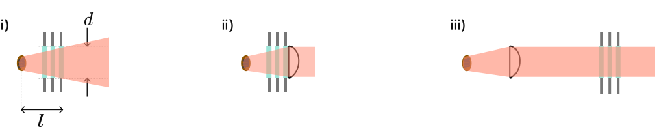
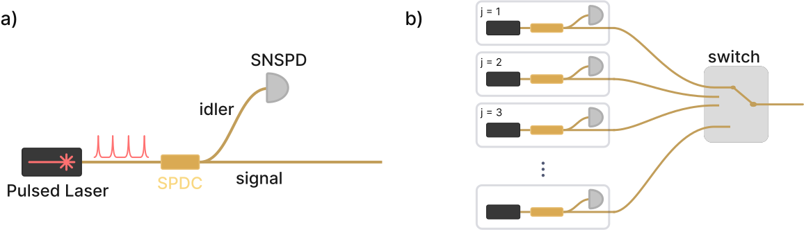

<!-- the html tag makes this only appear on the website -->
<!-- if you don't use the {=html} syntax, then the inside of the div would be rendered in the latex document -->
<!-- ```{=html}
<button style="display: block; margin-left: auto; margin-right: auto" class="md-button md-button--primary">Toggle Visibility of Homework Solutions</button></td>
``` -->
<!-- This span is processed by  pandoc-latex-color so that the color of the pdf will change also. -->
<!-- <span style="color:blue">Contact [Andrew Mueller](mailto:andrewstermueller@gmail.com) with any questions about the homework or solution manual. The solutions to some sections specify finer-grained point values when there are multiple answers per section. As the grader, feel free to use these or not. </span> -->

### 1. Free space coupling with low dark counts (50 points)
An experimental apparatus emits a collimated beam of $1550~\mathrm{nm}$ photons with Gaussian beam waist $w_0 = 3~\mathrm{mm}$. You wish to focus the beam onto an SNSPD directly through a window in a cryostat. 

{#fig:cryostat_concept short-caption="Cryostat free space coupling options" path="chapter_07"}

As we will see later on, a set of filters will be needed between the detector and the window to minimize dark counts. In practice, the set of filters can be quite thick. Say a $f = 100~\mathrm{mm}$ lens is used right outside the cryostat to focus the beam onto the detector though a set of filters (@Fig:cryostat_concept a). The long focal length makes room for a few inches of filters between the external lens and focused spot. 

<!-- This is a link to [The cryostat](./#fig:cryostat_concept) -->

1. (4 pts)
If the detector has a circular active area with radius $5~\mathrm{\upmu m}$, what ratio of power in the beam can it collect? Assume the detector has unity efficiency across all angles of incidence with respect to the surface normal. 


1. (4 pts)
 A faster lens mounted much closer to the detector inside the cryostat focuses to a smaller waist. Consider an $f = 18~\mathrm{mm}$ lens with the detector at the focal length (@Fig:cryostat_concept b). Verify more than 99% of the collimated light will be focused onto the active area of the detector.  


    Without filtering, the mid-infrared photons coupled to the detector from the room temperature laboratory are a dominant source of dark counts. Think of the environment outside the window as an isotropic blackbody emitter. Consider 3 cases, where the shaded red regions illustrate the light field of thermal radiation that could couple to the detector:

    {#fig:coupling_options short-caption="Three coupling options" path="chapter_07"}

    i) There is no lens; the detector is distance $l$ inside the cryostat, and the first window with diameter $d$ defines an entrance pupil. <br>
    ii) Same as (i), but a lens with focal length $l$ is placed right outside the first window. The detector is at the focal point. <br>
    iii) Same as (ii) but the lens is placed inside the cryostat with the detector still at the focal length. Equivalent to @Fig:cryostat_concept b above. <br>

3. (6 pts) Does (ii) couple more, less, or equal dark counts to the detector than (i)? What about case (iii)? Why? No calculations should be needed. 
(Hint: Consider the units of radiance, which characterizes a black body emitter. Etendue or beam parameter product may be useful concepts to consider). 


4. (9 pts) Using Planck's law  with laboratory temperature $T$ and the geometry of case (i) above, write an expression for spectral radiant flux (photons per unit wavelength) on the active area of a detector with radius $r$. 


5. (6 pts) Consider the configuration in @fig:cryostat_concept b.  The detector has an internal quantum efficiency approximated by: 

    ```{=html}
    ???+ note

        A more accurate model would include the transmission spectrum of the optical stack in which the nanowire is embedded, along with a non-unity coupling efficiency
    ```
    $$\eta(\lambda) = \frac{1}{2}(1 - \text{erf}[\lambda - 3~\mathrm{\upmu m}]).$$

    $\lambda$ is measured in $\mathrm{\upmu m}$ and $\text{erf}()$ is the error function. Using your conclusions from (1.3) and expression from (1.4), write a formula $N_{photons}[\lambda]$ for the number of detectable dark counts with respect to $\lambda$, then numerically integrate it to find the dark count rate with no filtering. The laboratory temperature $T$ is 293 K, lens focal length $l$ is $18~\text{mm}$, detector radius $r$ is $5~\mathrm{\upmu m}$, and the diameter $d$ of all optics is 1 inch. The maximum count rate of this SNSPD is 10 MHz. Is the detector usable or overexposed? 


6. (6 pts) A set of shortpass filters can remove the bulk of blackbody radiation. A shortpass filter can be roughly modeled with the formula:

    $$F(\lambda, E_t) = \frac{1}{E_t}[(E_t - 1)H(\lambda_c - \lambda) + 1]$$

    where H is the Heaviside step function, $\lambda_c$ is the cutoff wavelength of the filter, and $E_t$ is the extinction ratio of the filter. Use this with $N_{photons}[\lambda]$ from (d). How many filters with $\lambda_c = 1560~\text{nm}$ and $E_t = 30~\text{dB}$ are necessary to suppress the spectral region of detectable dark counts longer than 1560 nm so that it is not the dominant source of dark counts?


7. (7 pts)  If a narrow band filter is also inserted with center wavelength $1550~\text{nm}$ and spectral width below $1-2~nm$, then dark count rate can be approximated as just $N_{photons}[\lambda = 1550~\text{nm}]$ times the filter width. Show for this wavelength range you can simplify dark count rate further to a simple exponential function. If the laboratory air conditioner breaks, raising the lab temperature from 293 K to 300 K, how much higher is the dark count rate?

    A quantum communication experiment requires time-tagging photons with respect to a 50 GHz clock with 95% fidelity. That is, 95% of the timing measurements of detected photons emitted at the same time with respect to a clock fall within a 20 ps bin. Say the detector and readout electronics have a combined jitter of 10 ps FWHM, and a mode locked laser is used for the experiment that generates transform-limited Gaussian pulses. You tune its temporal length to a value for which the total timing uncertainty of time-tagged photons — including system jitter and pulse temporal length — matches the 95 % fidelity at 50 GHz requirement. Assume detector jitter has a Gaussian shape as well.

8. (8 pts) Find the spectral width of a filter that would transmit 95% of the photons from the mode locked laser. What is the dark count rate with this filter, using the expression from (1.7) and T = 293 K?


### 2. SPDC coupling and single photon sources (50 points)
A Spontaneous Parametric Down Conversion (SPDC) crystal is known to generate a twin beam squeezed state of the form: 


$$|\psi\rangle= \sqrt{1 - \gamma^2} \sum_{n=0}^{\infty} \gamma^{n}\left|n_{s}, n_{i}\right\rangle $$

```{=html}
??? note

    $\gamma = \sqrt{\mu/(1 + \mu)}$ where $\mu$ is the mean photon number per pulse which is proportional to pump power.
```

where $n_s$ and $n_i$ are the number of photons corresponding to the signal and idler parts of the wavefunction. Consider @fig:hsps a, where the crystal is pumped with a pulsed laser, and the signal and idler components that emerge are separated either by polarization or frequency. The idler arm is sent to an SNSPD. This configuration can be used as a heralded single photon source (HSPS). A click on the detector on the idler arm `heralds' a non-vacuum state in the signal arm. High fidelity and probability single photon sources are very useful for various quantum optics experiments and technologies, including linear optical quantum computing. 

{#fig:hsps short-caption="Heralded single photon source designs" path="chapter_07"}

Most SNSPDs are *binary*-type single photon detectors, meaning they differentiate between zero and one or more photons arriving in a given light pulse. A positive operator value measure (POVM) quantifies how a `click' from a binary SPD updates our knowledge of the incident state: 

$$\hat{\Pi}_{\text {binary}} = \sum_{n=0}^{\infty}\left[1-(1-\eta)^{n}\right]|n\rangle\langle n|$$

where $\eta$ is the coupling efficiency between the state of interest and the detector. 

```{=html}
??? note

    For coupling to the SPDC state, $\eta$ incorporates efficiency of the detector itself as well as coupling losses between the crystal and the detector
```

1. (6 pts) Find the expectation value of $\hat{\Pi}_{\text {binary}}$ given the SPDC state above. This is the probability $p_{binary}\left(\gamma, \eta\right)$ of getting a binary detector click on the idler arm. For $\gamma << 1$, what is $p_{binary}$ up to lowest order in $\gamma$, and what fock state of the signal arm is the source of this dominant term? 


2. (6 pts) A general form for the density matrix of the signal mode given a herald event is:

    $$\rho_{s}\left(\gamma, \eta\right)=\frac{\operatorname{Tr}_{i}\left(\hat{\Pi}|\psi\rangle\langle\psi|\right)}{\left\langle\psi\left|\hat{\Pi}\right| \psi\right\rangle}.$$

    Write down the $|1\rangle\langle1|$ term of this matrix, and simplify any infinite sums. This is the single photon fidelity $F_{binary}(\gamma, \eta)$. Why does $F_{binary}$ approach zero for $\gamma$ approaching 1? What types of states is the SPDC generating in this limit?  


    An HSPS with high single photon fidelity and probability is most useful, but you see these metrics are maximized for opposite limits of $\gamma$. One approach to achieving high probability and fidelity simultaneously is to link multiple SPDC sources and heralding detectors as shown in @Fig:hsps b. A click from the detector $j$ triggers the switch to move to position $j$ and let the heralded state pass through. This way, $\gamma$ for each source can be kept low to maximize fidelity, while heralding probability increases with the number of sources.

3. (6 pts) If such a multiplexing setup is engineered to have 98\% single photon fidelity from each source and 98\% heralding probability overall, how many sources and binary SNSPDs are needed? Use an idler arm efficiency $\eta$ of 80\%.

    ```{=html}
    ??? note

        Advances in linear optical quantum computing will likely require hundreds or thousands of high probability and fidelity single photon sources. As you should see, this many SNSPDs for each is impractical.
    ```

A photon number resolving (PNR) SNSPD is able to discriminate the number of photons in a light pulse*. By heralding the idler mode with a PNR SNSPD, the generation of multi-photon signal pulses can be identified and discarded. There is a POVM for an ideal PNR single photon detector, where $i$ is the number of photons detected:

```{=html}
??? note

    *at or below the few-photon level. Some types only accurately differentiate between 1 and more than one detection.

    **A PNR SNSPD can be made from an array of binary SNSPS, or from a single nanowire with efficient impedance matching to its readout circuit (like JPL's Differential Single Pixel (DSP) shown in lecture that exhibits photon number information in the slope or height of the RF pulse rising edge). The POVM is idealized in the sense that detector efficiency is independent of the number of photons detected. In practice this is not the case, but for the latest types of PNR SNSPDs, this POVM is good approximation.
```
$$\hat{\Pi}_{PNR}(i)=\sum_{n=i}^{\infty}\binom{n}{i}(1-\eta)^{n-i} \eta^{i}|n\rangle\langle n|.$$

4. (12 pts) Derive a herald probability $p_{PNR}$ and fidelity $F_{PNR}$ for the PNR POVM, following the steps in the previous sections with $i$ set to 1. You can use symbolic math tools to simplify them if you wish. The probability of successfully heralding states in the signal arm $p_{PNR}$ should now approach zero for $\gamma$ near one. Why is this? 
   

5. (12 pts) Make a parametric plot for $0<\gamma<1$ with $F_{PNR}$ on the x-axis and $p_{PNR}$ on the y-axis. Plot the curve for a few different values of idler arm efficiency $0<\eta<1$. All curves should reach the same maximum herald probability. What is it? 
   

6. (8 pts) Consider again the configuration in @Fig:hsps b. Find the number of sources using PNR detectors needed to reach 98\% single photon herald probability and fidelity with $\eta = 0.8$. Also find the number of sources for $\eta = 0.95$.


<!-- Keep at end of the page! -->
<script src="./code/section_06.js"></script>