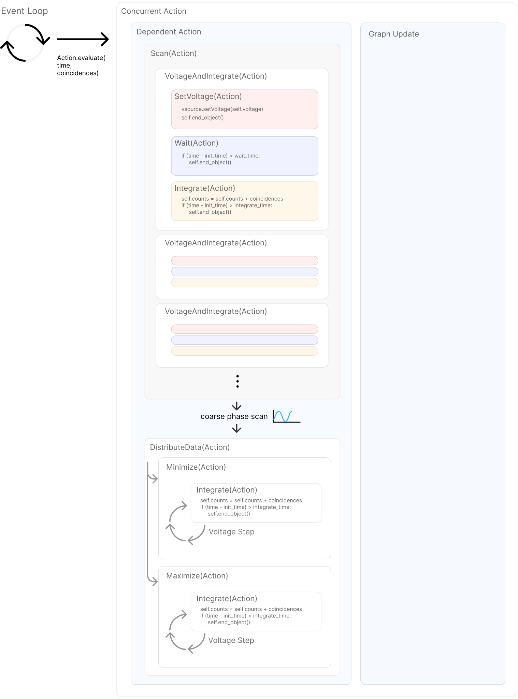

## Experiment and control software

### Sequence generator

The Sequence Generator repository is for generating AWG sequences that are synchronized with the Pritel OAC fast mode locked laser. This is needed for carving the mode locked laser signal with intensity modulators. This toolkit was useful for my PPM project as well as a concurrent high rate QKD project with slightly different requirements.

The most important feature of this codebase is the ability to determine compatible AWG sample rates and sequence lengths for a given laser repetition rate, while imposing certain requirements, like that the AWG sequence length must be a multiple of 128 samples. The script supports situations where a small integer number of laser pulses does not match in time with an integer number of AWG samples. The main requirement is that the time for the full AWG sequence to run must be an integer multiple of the laser repetition period, so that the AWG sequence can be repeated indefinitely without drifting out of sync with the laser.

This analysis is performed in the functions `determine_ppm_properties` and `determine_`-`regular_properties` for the PPM and QKD applications, respectively.

```{=html}
<a class="md-button" style="width: 30%; display: block; margin: auto; text-align: center;" href="https://github.com/sansseriff/sequence_generator/tree/main">Repository <span class="twemoji"><svg xmlns="http://www.w3.org/2000/svg" viewBox="0 0 448 512"><path d="M439.55 236.05 244 40.45a28.87 28.87 0 0 0-40.81 0l-40.66 40.63 51.52 51.52c27.06-9.14 52.68 16.77 43.39 43.68l49.66 49.66c34.23-11.8 61.18 31 35.47 56.69-26.49 26.49-70.21-2.87-56-37.34L240.22 199v121.85c25.3 12.54 22.26 41.85 9.08 55a34.34 34.34 0 0 1-48.55 0c-17.57-17.6-11.07-46.91 11.25-56v-123c-20.8-8.51-24.6-30.74-18.64-45L142.57 101 8.45 235.14a28.86 28.86 0 0 0 0 40.81l195.61 195.6a28.86 28.86 0 0 0 40.8 0l194.69-194.69a28.86 28.86 0 0 0 0-40.81z"></path></svg></span></a>
```

<span class="latex">\href{https://github.com/sansseriff/sequence_generator/tree/main}{Sequence generator repository}</span>

### Time-walk correction

A repository of tools for performing time-walk calibration and correction on timetag data files. It is set up to use the binary format `.ttbin` from Swabian timetaggers but can be easily adapted to other formats.

```{=html}
<a class="md-button" style="width: 30%; display: block; margin: auto; text-align: center;" href="https://github.com/sansseriff/SNSPD-time-walk-and-jitter-correction">Repository <span class="twemoji"><svg xmlns="http://www.w3.org/2000/svg" viewBox="0 0 448 512"><path d="M439.55 236.05 244 40.45a28.87 28.87 0 0 0-40.81 0l-40.66 40.63 51.52 51.52c27.06-9.14 52.68 16.77 43.39 43.68l49.66 49.66c34.23-11.8 61.18 31 35.47 56.69-26.49 26.49-70.21-2.87-56-37.34L240.22 199v121.85c25.3 12.54 22.26 41.85 9.08 55a34.34 34.34 0 0 1-48.55 0c-17.57-17.6-11.07-46.91 11.25-56v-123c-20.8-8.51-24.6-30.74-18.64-45L142.57 101 8.45 235.14a28.86 28.86 0 0 0 0 40.81l195.61 195.6a28.86 28.86 0 0 0 40.8 0l194.69-194.69a28.86 28.86 0 0 0 0-40.81z"></path></svg></span></a>
```

<span class="latex">\href{https://github.com/sansseriff/SNSPD-time-walk-and-jitter-correction}{Time walk correction repository}</span>

### Bias controll user interface

A web-based user interfaces for controlling isolated voltage sources used for SNSPD biasing. Is is an improvement over a previous web interface which is based on the [svelte frontend framework](https://svelte.dev/) and should be much easier to maintain and extend than the [previous web interface](https://github.com/sansseriff/Isolated_Vsource).

```{=html}
<a class="md-button" style="width: 30%; display: block; margin: auto; text-align: center;" href="https://github.com/sansseriff/snspd-bias-controll-svelte">Repository <span class="twemoji"><svg xmlns="http://www.w3.org/2000/svg" viewBox="0 0 448 512"><path d="M439.55 236.05 244 40.45a28.87 28.87 0 0 0-40.81 0l-40.66 40.63 51.52 51.52c27.06-9.14 52.68 16.77 43.39 43.68l49.66 49.66c34.23-11.8 61.18 31 35.47 56.69-26.49 26.49-70.21-2.87-56-37.34L240.22 199v121.85c25.3 12.54 22.26 41.85 9.08 55a34.34 34.34 0 0 1-48.55 0c-17.57-17.6-11.07-46.91 11.25-56v-123c-20.8-8.51-24.6-30.74-18.64-45L142.57 101 8.45 235.14a28.86 28.86 0 0 0 0 40.81l195.61 195.6a28.86 28.86 0 0 0 40.8 0l194.69-194.69a28.86 28.86 0 0 0 0-40.81z"></path></svg></span></a>
```

<span class="latex">\href{https://github.com/sansseriff/snspd-bias-controll-svelte}{Svelte bias control repository}</span>

### Entanglement analysis repositories

This master repository contains submodules for all the repositories used for analyzing data from the high-rate entanglement distribution system. It includes a script for automatically populating each repository with the original raw data stored on Figshare.

```{=html}
<a class="md-button" style="width: 30%; display: block; margin: auto; text-align: center;" href="https://github.com/sansseriff/highrate_origin">Repository <span class="twemoji"><svg xmlns="http://www.w3.org/2000/svg" viewBox="0 0 448 512"><path d="M439.55 236.05 244 40.45a28.87 28.87 0 0 0-40.81 0l-40.66 40.63 51.52 51.52c27.06-9.14 52.68 16.77 43.39 43.68l49.66 49.66c34.23-11.8 61.18 31 35.47 56.69-26.49 26.49-70.21-2.87-56-37.34L240.22 199v121.85c25.3 12.54 22.26 41.85 9.08 55a34.34 34.34 0 0 1-48.55 0c-17.57-17.6-11.07-46.91 11.25-56v-123c-20.8-8.51-24.6-30.74-18.64-45L142.57 101 8.45 235.14a28.86 28.86 0 0 0 0 40.81l195.61 195.6a28.86 28.86 0 0 0 40.8 0l194.69-194.69a28.86 28.86 0 0 0 0-40.81z"></path></svg></span></a>
```

<span class="latex">\href{https://github.com/sansseriff/highrate_origin}{Entanglement analysis repository}</span>

### Entanglement control software

Based on an example file shipped with the swabian timetagger, this leverages the swabian python api for collecting entanglement data for the high-rate entanglement distribution system. It incorporates an innovative method for defining long running measurements based on a construct called `Actions`. `Actions` are objects that perform some operation at one stage in the script's main event loop (e.g., change an interferometer voltage to a specific value), or over multiple event loop iterations (e.g., integrate coincidences). Actions may also contain and run other actions, so that successively more complex measurements can be built from simple reusable components. This is done through an `evaluate` method that all `Action` methods share. The base class for all actions is located in `measurements/measurement`-`_management.py`. When a complex measurement is finished, a highly nested construct of actions may export its internal data to a `.json` file. The high-rate experiment [analysis repositories](https://github.com/sansseriff/highrate_origin) start with loading and analyzing these `.json` files.

```{=html}
<a class="md-button" style="width: 30%; display: block; margin: auto; text-align: center;" href="https://github.com/sansseriff/swabian_entanglement_gui">Repository <span class="twemoji"><svg xmlns="http://www.w3.org/2000/svg" viewBox="0 0 448 512"><path d="M439.55 236.05 244 40.45a28.87 28.87 0 0 0-40.81 0l-40.66 40.63 51.52 51.52c27.06-9.14 52.68 16.77 43.39 43.68l49.66 49.66c34.23-11.8 61.18 31 35.47 56.69-26.49 26.49-70.21-2.87-56-37.34L240.22 199v121.85c25.3 12.54 22.26 41.85 9.08 55a34.34 34.34 0 0 1-48.55 0c-17.57-17.6-11.07-46.91 11.25-56v-123c-20.8-8.51-24.6-30.74-18.64-45L142.57 101 8.45 235.14a28.86 28.86 0 0 0 0 40.81l195.61 195.6a28.86 28.86 0 0 0 40.8 0l194.69-194.69a28.86 28.86 0 0 0 0-40.81z"></path></svg></span></a>
```

<span class="latex">\href{https://github.com/sansseriff/swabian_entanglement_gui}{Entanglement control software repository}</span>

```{=html}

More information about the `Action` framework:

???+ Action-Framework

    The time tagger software I use has a main event loop and runs a series of python functions multiple times per second to pull in new data and display it to the graphs on screen. I've found it non-trivial to add long-term complex behavior inside this software construct. The program can be written to do different operations on different even loop cycles (for example, starting an integration, ending an integration or changing the interferometer voltage) with a series of complicated if-statements. But this approach quickly becomes untenable with many deeply nested if-statements and program state that is hard to reason about. Therefore, I developed a system of tasks or `Actions` that may be added to a task queue and 'consumed' by the main even loop. Each `Action` is an object that exposes an `.evaluate()` method that is called inside the program's main loop. Action objects can contain other action objects, so that the `.evaluate()` method of the parent action calls the `.evaluate()` method on a list of child actions it contains or manages.

    #### A bare-bones base action class

    *certain details of the implementation have been removed for clarity*

    &&&python
    class Action:
        def __init__(self):
            self.event_list = []
            self.init_time = -1
            self.results = []
            self.save = False

        def add_action(self, object):
            self.event_list.append(object)

        def evaluate(self, current_time, counts, **kwargs):
            if self.pass_state:
                return {"state": "passed"}
            response = self.event_list[0].evaluate(current_time, counts)
            if (response["state"] == "finished"):
                response.pop("state", None)
                self.results.append(response)
                self.event_list.pop(0)
                # if all internal actions are finished, finish this action
                if len(self.event_list) == 0:
                    self.final_state = {
                        "state": "finished",
                        "name": self.__class__.__name__,
                        "results": self.flatten(self.results),
                    }
                # if the current internal action is finished,
                # recursively call the next
                self.evaluate(current_time, counts)
            return {"state": "waiting", "results": response}
    &&&


    Actions can be in multiple states depending on if the event loop has not yet reached them, is currently evaluating them ('waiting' or 'integrating'), or has finished them ('finished'). Actions signal that they are 'finished' by returning a dictionary including `{"state": "finished"}` along with other results from the completion of the action.

    #### An `Integrate` operation, that inherits from `Action`

    &&&python
        class Integrate(Action):
            def __init__(self, int_time):
                super().__init__()
                self.int_time = int_time
                self.counts = 0

            def evaluate(self, current_time, counts, **kwargs):
                if self.init_time == -1:
                    self.init_time = time.time()
                    return {"state": "integrating"}
                self.counts = self.counts + counts  # add counts

                if (current_time - self.init_time) > self.int_time:
                    self.delta_time = current_time - self.init_time
                    self.final_state = {
                        "state": "finished",
                        "name": self.__class__.__name__,
                        "counts": self.counts,
                        "delta_time": self.delta_time,
                    }
                    return self.final_state
                return {"state": "integrating"}
    &&&


    The exact time that new data is acquired is determined by the timing of the main event loop. So the `Integrate` action cannot integrate for an exact amount of time. But it can integrate for the necessary number of event loops and extract an accurate measure of photons or coincidences per second based on the elapsed time.


    `Wait()` or `SetVoltage()` actions can be defined in a similar way, so that the behavior of a more complex action containing other actions can be specified like this

    &&&python
    voltage_and_integrate = Action()
    voltage_and_integrate.add_action(SetVoltage(voltage_value))
    voltage_and_integrate.add_action(Wait(wait_time))
    voltage_and_integrate.add_action(Integrate(integration_time))
    &&&


    The course scan, and coordinate search methods I use to find the entanglement visibility are implemented in this action framework. There are a couple special action types. `DependentAction` takes data returned from the finishing first internal action and passes it to the next internal action. `ConcurrentAction` passes data between internal actions that is returned from the internal `.evaluate()` methods upon each event loop cycle. This is used to move data from the measurement actions to the graph action.


    {#fig:action_framework short-caption="Nested action framework" path="chapter_08"}

    This is the code that defines the operations for finding entanglement visibility:

    &&&python
    tracker = Action()
    self.event_loop_action = tracker
    scan_and_find_extremes = DependentAction("coarse_scan")
    scan_and_find_extremes.add_action(Scan(params["int_fast"], self.VSource))
    minimum_and_maximum = DistributeData("coarse_scan")
    minimum = Extremum(
        "min", 2, 1, 0.02, self.VSource, 0, "coarse_scan", fine_grain_mode=True)
    minimum.enable_save(save_name="minimum_data.json")
    minimum_and_maximum.add_action(minimum)
    maximum = Extremum(
        "max", 1, 4, 0.2, self.VSource, 0, "coarse_scan", fine_grain_mode=True)
    maximum.enable_save(save_name="maximum_data.json")
    minimum_and_maximum.add_action(maximum)
    scan_and_find_extremes.add_action(minimum_and_maximum)
    tracker.add_action(SetVoltage(0, self.VSource, 2))
    tracker.add_action(Wait(10))
    tracker.add_action(
        ConcurrentAction(scan_and_find_extremes,
        GraphUpdate(self.clockAxis)))
    tracker.enable_save(save_name=params["save_name"])
    &&&

```

### Dark count rate through filters simulation

Based on the known lens f-number, aperture size, detector size, and filter transmissions for the dark count minimization project, the rate of dark counts due to transmitted blackbody photons can be estimated. With this simulation we determined that 4 thick custom short-pass filters, and one bandpass filter were ideal for our experiment.

````{=html}
<a class="md-button" style="width: 30%; display: block; margin: auto; text-align: center;" href="https://github.com/sansseriff/dark_count_simulation">Repository <span class="twemoji"><svg xmlns="http://www.w3.org/2000/svg" viewBox="0 0 448 512"><path d="M439.55 236.05 244 40.45a28.87 28.87 0 0 0-40.81 0l-40.66 40.63 51.52 51.52c27.06-9.14 52.68 16.77 43.39 43.68l49.66 49.66c34.23-11.8 61.18 31 35.47 56.69-26.49 26.49-70.21-2.87-56-37.34L240.22 199v121.85c25.3 12.54 22.26 41.85 9.08 55a34.34 34.34 0 0 1-48.55 0c-17.57-17.6-11.07-46.91 11.25-56v-123c-20.8-8.51-24.6-30.74-18.64-45L142.57 101 8.45 235.14a28.86 28.86 0 0 0 0 40.81l195.61 195.6a28.86 28.86 0 0 0 40.8 0l194.69-194.69a28.86 28.86 0 0 0 0-40.81z"></path></svg></span></a>
<a class="md-button" style="width: 30%; display: block; margin: auto; text-align: center;" href="https://github.com/sansseriff/dark_count_simulation">Repository <span class="twemoji"><svg xmlns="http://www.w3.org/2000/svg" viewBox="0 0 448 512"><path d="M439.55 236.05 244 40.45a28.87 28.87 0 0 0-40.81 0l-40.66 40.63 51.52 51.52c27.06-9.14 52.68 16.77 43.39 43.68l49.66 49.66c34.23-11.8 61.18 31 35.47 56.69-26.49 26.49-70.21-2.87-56-37.34L240.22 199v121.85c25.3 12.54 22.26 41.85 9.08 55a34.34 34.34 0 0 1-48.55 0c-17.57-17.6-11.07-46.91 11.25-56v-123c-20.8-8.51-24.6-30.74-18.64-45L142.57 101 8.45 235.14a28.86 28.86 0 0 0 0 40.81l195.61 195.6a28.86 28.86 0 0 0 40.8 0l194.69-194.69a28.86 28.86 0 0 0 0-40.81z"></path></svg></span></a>
```an class="latex">\href{https://github.com/sansseriff/dark_count_simulation}{Dark count rate simulation repository}</span><span class="latex">\href{https://github.com/sansseriff/dark_count_simulation}{Dark count rate simulation repository}</span>
````
