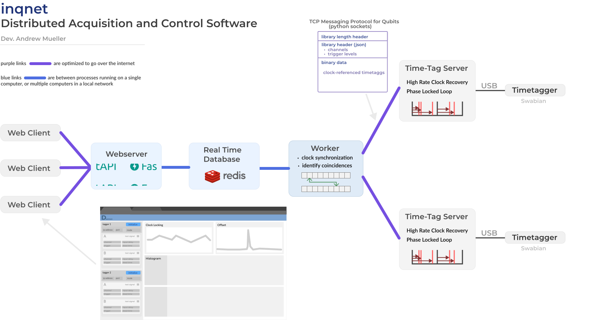

## Future directions

### Distributed Data Acquisition and Control Software (DDAQ)

{#fig:ddaq short-caption="DDAQ system architecture" path="chapter_09"}

In order to do distributed quantum communication and network demonstrations, quantum nodes must be able to make accurate time-correlated measurements with respect to a shared clock, and then communicate those measurements to other parties in the network. 

The process of sharing an accurate clock between locations is a challenge in itself. For the [high rate entanglement project](.../chapter_05/), an RF clock is currently used to synchronize one timetagger with the laser. However, we expect later versions of the system will be able to extract the clock directly from the quantum signals themselves using a phased locked loop in software. 

If this works, then the challenge in demonstrating distributed entanglement revolves around sending information about the timing of photon detections over the internet, and aligning them in time to determine what events correspond to coincidences and therefore valid qubits. 

The architecture of the DDAQ software handles this by defining 'worker' computers and 'time-tag server' computers that communicate with each other over TCP sockets. The time-tag servers assign each SNSPD measurement a 'clock index' which is analogous to the number of clock cycles that have passed at the time of the measurement since the whole experiment or the timetagger was initialized. Two different time-tag severs will record the measurements of an entangled pair with two different clock indexes (as it's expected that the hardware of each timetagger was not initialized at exactly the same time). It is the job of 'worker' computers to compare the statistics received from time-tag servers to determine what offset relates the clock indexes of two time-tag servers. We expect the process of identifying the offset will involve a computation similar to a that of a multi-start multi-stop histogram or correlation measurement.

If the offset can be found, then the worker computer can correct for it and find events that match between the time-tag servers and identify the measurement of entangled photon pairs. 

The time for messages to travel from time-tag servers to worker computers varies depending on network state and congestion. Therefore, the worker computer must maintain a buffer of measurements collected over a period at least as long as the longest network-induced relative delays. Then coincidences are identified by searching back through the buffer for identical clock indexes, after the clock index offset has been corrected. 

In addition to the clock index which encodes timing information of detections down to the repetition rate of the clock, a 2nd measurement for each photon detection may also be sent which encodes the event timing within the given clock cycle. With this, it will be possible to draw histograms of the three 'early, middle, and late' peaks in a time-bin entanglement distribution experiment. 

As of December 2022, a simple version of the time-tag server [has been developed](https://github.com/sansseriff/tag_gui/blob/master/tag_server.py), and socket transmission of timestamp numpy arrays was demonstrated with a [basic client program](https://github.com/sansseriff/tag_gui/blob/master/client_manger.py). The buffer-based coincidence detection system has not been developed. 